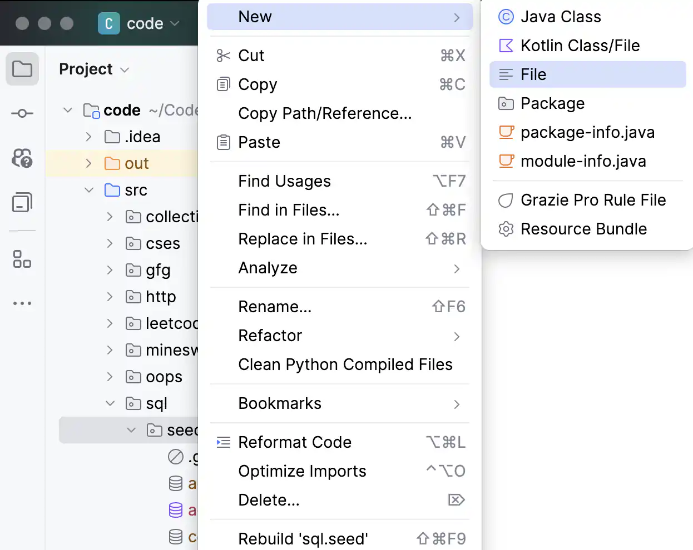

# SQL-Ex.ru local setup

This document explains how to set up a local SQLite database in JetBrains DataGrip or IntelliJ IDEA Ultimate Edition for practicing SQL queries on [SQL Exercises](https://www.sql-ex.ru/).

## VSCode Setup (Not the best IDE experience for SQL)

Jetbrains has the best SQL IDE support (IMO). However, if your computer RAM and SSD is not good enough for running Jetbrains IDE, you can also use SQL in VSCode using these extensions:
- [SQLTools](https://marketplace.visualstudio.com/items?itemName=mtxr.sqltools)
- [SQLTools SQLite](https://marketplace.visualstudio.com/items?itemName=mtxr.sqltools-driver-sqlite)

## SQLite database in JetBrains DataGrip / IntelliJ IDEA Ultimate Edition

An SQLite database is essentially a file. You can create an empty file, and turn it into a database.
1. Create an empty file with `.sqlite` or `.db` extension (works with any other extension too, does not matter). This will be our database.
    
2. Add SQLite datasource in jetbrains
    
    
3. Select the file you created in step 1.
    
4. Download missing driver files if required.
    
5. Create a new SQL console file (extension must be `.sql`). This is where you will write your SQL queries and run them. Also, select the database context and local dialect as SQLite for the console
    
6. Prepare your local database for the exercises in https://www.sql-ex.ru/ .
    - Copy the SQL seed script for the respective database present in this folder with name `<database-name>.sql`. The headings below point to the respective files.
    - Paste it in the SQL console.
    - Run the script. Tip: You can select some text in the console, and press `Ctrl+Enter` to execute the selected text.
    - You can see the tables and data in the database explorer.
    

## Databases

These are the databases used by SQL Exercises. You can find the seed scripts in the respective files linked below.

### [Computer DB](./computer.sql)

### [Ships DB](./ships.sql)

### [Inc Out DB](./inc_out.sql)

### [Painting DB](./painting.sql)

### [Aero DB](./aero.sql)

