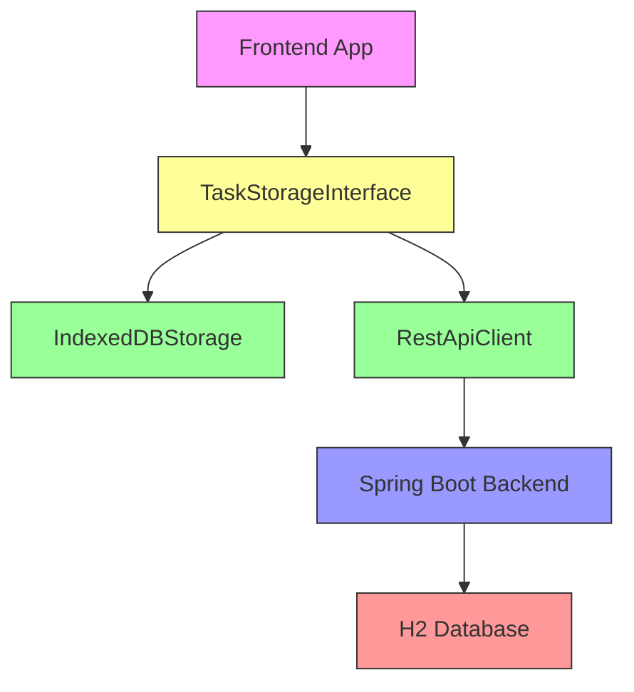
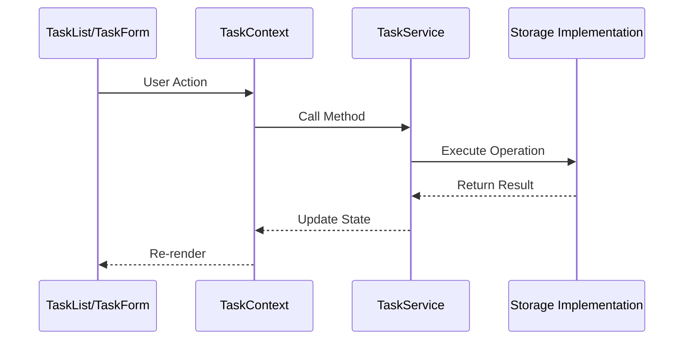
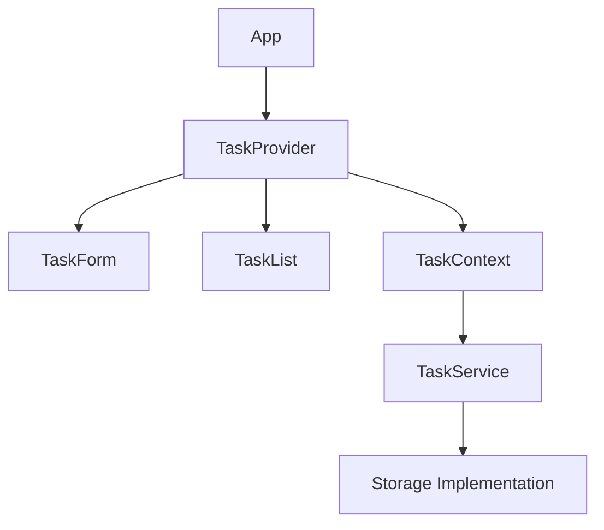
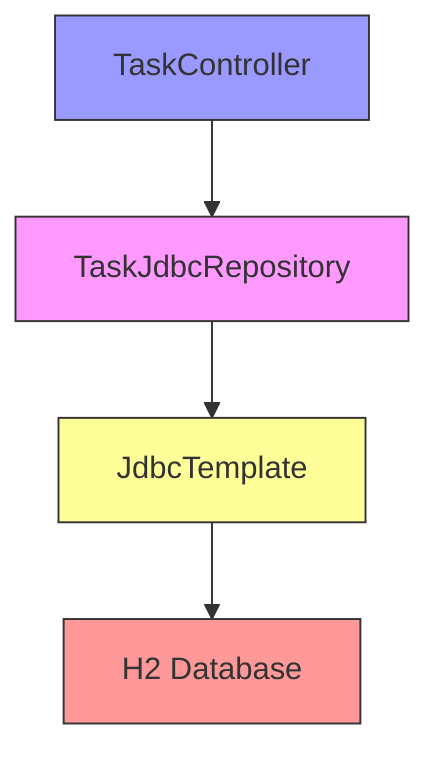

# Task Manager Application Documentation

## Overview
This application is a task management system built with a modern, decoupled architecture. The frontend uses vanilla JavaScript with Preact (via CDN), while the backend is powered by Spring Boot with H2 database support.

## Architecture

### Component Diagram


### Frontend Data Flow


## Frontend Architecture

### No Build Tools Required
The frontend is built without any build tools, using:
- ES Modules for code organization
- CDN-delivered dependencies
- Import maps for dependency management

Reference the import map configuration:

```html
<!--9:17:src/main/resources/static/index.html-->
  <script type="importmap">
    {
        "imports": {
            "preact": "https://esm.sh/preact@10.23.1",
            "htm/preact": "https://esm.sh/htm@3.1.1/preact?external=preact",
            "preact/hooks": "https://esm.sh/preact@10.23.1/hooks"
        }
    }
    </script>
```


### Storage Interface Pattern
The application uses an abstract storage interface that allows switching between:
1. IndexedDB (client-side storage)
2. REST API (server communication)

The interface definition:

```js
// 1:22:src/main/resources/static/js/services/TaskStorageInterface.js
// Interface for Task Storage implementations
export class TaskStorageInterface {
  async createTask(task) {
    throw new Error('Not implemented');
  }

  async getAllTasks() {
    throw new Error('Not implemented');
  }

  async updateTask(id, task) {
    throw new Error('Not implemented');
  }

  async deleteTask(id) {
    throw new Error('Not implemented');
  }

  async getTasksByUserId(userId) {
    throw new Error('Not implemented');
  }
}
```


### Storage Implementation Selection
Storage implementation can be switched in the taskService configuration:

```js
// 1:9:src/main/resources/static/js/services/taskService.js
import { IndexedDBStorage } from './IndexedDBStorage.js';
import { RestApiClient } from './RestApiClient.js';

// Choose which implementation to use
const storage = new IndexedDBStorage();
// const storage = new RestApiClient();

// Export the storage implementation as the taskService
export const taskService = storage;
```


## Backend Architecture

### Database Layer
- H2 Database with both JPA and JDBC support
- Raw SQL queries via JdbcTemplate
- Schema defined in schema.sql

Database schema:

```sql
-- 1:9:src/main/resources/schema.sql
CREATE TABLE IF NOT EXISTS task (
    id BIGINT AUTO_INCREMENT PRIMARY KEY,
    title VARCHAR(255) NOT NULL,
    description VARCHAR(1000),
    status VARCHAR(20),
    category VARCHAR(50),
    due_date DATE,
    user_id BIGINT
); 
```


### API Endpoints

| Endpoint                 | Method | Description       |
| ------------------------ | ------ | ----------------- |
| `/api/tasks`             | GET    | Get all tasks     |
| `/api/tasks`             | POST   | Create new task   |
| `/api/tasks/{id}`        | PUT    | Update task       |
| `/api/tasks/{id}`        | DELETE | Delete task       |
| `/api/tasks?userId={id}` | GET    | Get tasks by user |

## Component Interactions

### Frontend Components


### Backend Components


## Key Features
1. Decoupled frontend and backend
2. Switchable storage implementations
3. No build tools required for frontend
4. Raw SQL support via JdbcTemplate
5. Modern component-based UI with Preact
6. Category-based task filtering
7. Real-time UI updates

## Configuration
The application can be configured through:

```yaml
# 1:15:src/main/resources/application.yaml
spring:
  application:
    name: TaskManager
  datasource:
    url: jdbc:h2:file:./h2
    username: user
    password: pass
    driver-class-name: org.h2.Driver
  h2:
    console:
      enabled: true
      path: /h2-console
  sql:
    init:
      mode: always
```


This architecture allows for:
- Easy switching between storage implementations
- Independent frontend development
- Simple deployment (single JAR)
- Flexible database access (JPA/JDBC)
