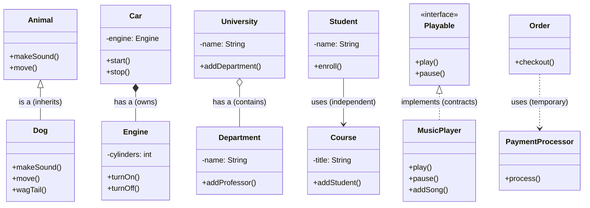
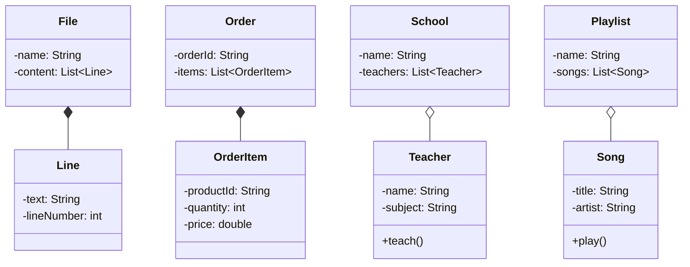
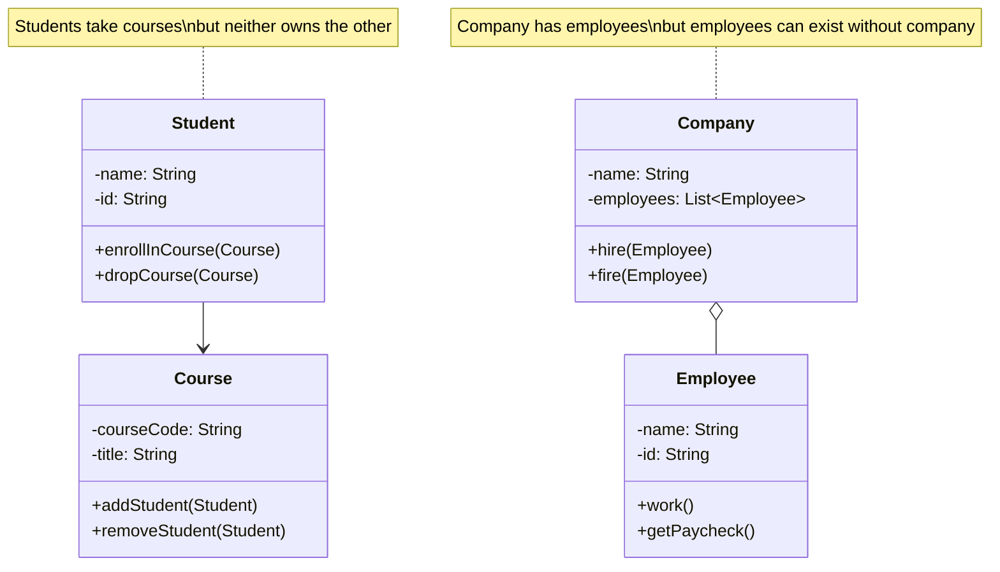

User: what are all these relationships between classes? when applicable? can you give examples?

Here is the syntax:

```
Copy
[Relation Type][Link][Relation Type]
Where Relation Type can be one of:
TypeDescription<|Inheritance\*CompositionoAggregation>Association<Association|>Realization
And Link can be one of:
TypeDescription--Solid..Dashed
Lollipop Interfaces
Classes can also be given a special relation type that defines a lollipop interface on the class. A lollipop interface is defined using the following syntax:
* bar ()-- foo
* foo --() bar
The interface (bar) with the lollipop connects to the class (foo).
Note: Each interface that is defined is unique and is meant to not be shared between classes / have multiple edges connecting to it.
```

---

I'll create diagrams to illustrate different types of class relationships with practical examples.




Let me explain each relationship type with real-world examples:

1. **Inheritance (`<|--`)**
   - Solid line with empty triangle pointing to parent
   - Used when one class "is-a" type of another class
   - Example: `Dog` inherits from `Animal`
   ```java
   class Animal {
       public void makeSound() { }
   }
   class Dog extends Animal {
       public void wagTail() { }
   }
   ```

2. **Composition (`*--`)**
   - Solid line with filled diamond
   - Used when one class "owns" another class (strong relationship)
   - Child cannot exist without parent
   - Example: `Car` and `Engine`
   ```java
   class Car {
       private Engine engine;  // Engine can't exist without Car
       public Car() {
           engine = new Engine();
       }
   }
   ```

3. **Aggregation (`o--`)**
   - Solid line with empty diamond
   - Used when one class "has" another class (weak relationship)
   - Child can exist independently
   - Example: `University` and `Department`
   ```java
   class University {
       private List<Department> departments;  // Departments can exist independently
       public void addDepartment(Department dept) {
           departments.add(dept);
       }
   }
   ```

4. **Association (`-->` or `<--`)**
   - Simple solid line
   - Used when classes are related but independent
   - Example: `Student` and `Course`
   ```java
   class Student {
       private List<Course> courses;
       public void enroll(Course course) {
           courses.add(course);
       }
   }
   ```

5. **Implementation/Realization (`<|..`)**
   - Dashed line with empty triangle
   - Used when a class implements an interface
   - Example: `MusicPlayer` implements `Playable`
   ```java
   interface Playable {
       void play();
       void pause();
   }
   class MusicPlayer implements Playable {
       public void play() { }
       public void pause() { }
   }
   ```

6. **Dependency (`..>`)**
   - Dashed line with arrow
   - Used when one class uses another class temporarily
   - Example: `Order` depends on `PaymentProcessor`
   ```java
   class Order {
       public void checkout(PaymentProcessor processor) {
           processor.process();  // Temporary usage
       }
   }
   ```

Here's when to use each:

1. Use **Inheritance** when:
   - You have an "is-a" relationship
   - You want to share common behavior
   - The child class is a specialized version of the parent

2. Use **Composition** when:
   - You have a "part-of" relationship
   - The child object can't exist without the parent
   - You want strong ownership and lifecycle control

3. Use **Aggregation** when:
   - You have a "has-a" relationship
   - The child object can exist independently
   - You want to represent ownership without lifecycle control

4. Use **Association** when:
   - Objects are related but independent
   - Objects have their own lifecycles
   - The relationship is more of a "uses" than "has"

5. Use **Implementation** when:
   - You want to define a contract
   - Multiple classes share common behavior
   - You need polymorphism

6. Use **Dependency** when:
   - One class uses another temporarily
   - The relationship is weak and temporary
   - You want to keep classes loosely coupled

Would you like me to create more specific examples for any of these relationships or explain how they relate to SOLID principles?

---

User: Composition vs Aggregation - What's the difference, make it clear.

---

Ah, I understand your confusion! Let me clarify this with better real-world examples.




Let me explain with better examples:

**Composition** (Strong "owns" relationship - parts die with the whole)
1. **File and Lines**
   ```java
   class File {
       private List<Line> lines;
       
       // When File is deleted, all its Lines are deleted
       // Lines only make sense within this specific File
       // You can't move a Line object to another File
   }
   ```

2. **Order and OrderItems**
   ```java
   class Order {
       private List<OrderItem> items;
       
       // When Order is deleted, its OrderItems are deleted
       // An OrderItem can't exist without its parent Order
       // You can't move an OrderItem to another Order
   }
   ```

**Aggregation** (Weak "has" relationship - parts can exist independently)
1. **School and Teachers**
   ```java
   class School {
       private List<Teacher> teachers;
       
       // If School closes, Teachers still exist
       // Teachers can work at different schools
       // A Teacher object can be removed from one school and added to another
   }
   ```

2. **Playlist and Songs**
   ```java
   class Playlist {
       private List<Song> songs;
       
       // If Playlist is deleted, Songs still exist
       // Same Song can be in multiple playlists
       // Songs exist independently of any playlist
   }
   ```

Key Differences:
1. **Lifecycle Dependency**
   - Composition: When parent is destroyed, children are destroyed
   - Aggregation: When parent is destroyed, children continue to exist

2. **Exclusivity**
   - Composition: Child belongs to only one parent at a time
   - Aggregation: Child can belong to multiple parents

3. **Identity**
   - Composition: Child's identity is tied to parent
   - Aggregation: Child has its own independent identity

Better Examples of Each:

**Composition:**
- Human body and organs (organs can't exist without the body)
- Word document and paragraphs (paragraphs don't exist outside their document)
- Bank account and transactions (transactions belong to specific account)

**Aggregation:**
- Library and books (books can exist without library)
- University and students (students can exist without university)
- Company and employees (employees can exist without company)

I apologize for the confusing car/engine example earlier - you're right that an engine can exist independently of a car (it could be used in a boat, or stored in a warehouse), making it more of an aggregation relationship than a composition relationship.

Would you like me to provide more examples or explain any other aspects of these relationships?

---

association vs aggregation. both java code look the same. how do they differ?

---

Ah, excellent observation! You're right - in Java code, association and aggregation can look very similar. The key difference is not in the syntax, but in the semantic relationship between the objects. Let me explain with clear examples:




Let's look at both with practical examples:

**Association** (uses-a relationship):
```java
// Simple connection between classes
class Student {
    private List<Course> courses;  // Student takes courses
    
    public void enrollInCourse(Course course) {
        courses.add(course);
        course.addStudent(this);  // Both sides know about each other
    }
}

class Course {
    private List<Student> students;  // Course has students
    
    public void addStudent(Student student) {
        students.add(student);
    }
}

// Usage
Student alice = new Student();
Course math = new Course();
alice.enrollInCourse(math);  // Simple association
```

**Aggregation** (has-a relationship):
```java
// Represents ownership (but parts can exist independently)
class Company {
    private List<Employee> employees;  // Company owns/contains employees
    
    public void hire(Employee employee) {
        employees.add(employee);
        employee.setCompany(this);
    }
}

class Employee {
    private Company company;  // Employee belongs to company
    
    public void setCompany(Company company) {
        this.company = company;
    }
}

// Usage
Company techCorp = new Company();
Employee bob = new Employee();  // Can exist without company
techCorp.hire(bob);  // Now part of company
```

Key differences:
1. **Ownership**
   - Association: Neither class owns the other
   - Aggregation: One class "has" the other (but doesn't control its lifecycle)

2. **Relationship Strength**
   - Association: Weaker relationship (just "uses")
   - Aggregation: Stronger relationship (ownership without lifecycle control)

3. **Typical Real-World Examples**:
   - Association:
     - Student and Course (take/enrolled)
     - Doctor and Patient (treats)
     - Driver and Car (drives)
   
   - Aggregation:
     - Company and Employee (has)
     - Library and Book (contains)
     - Team and Player (consists of)

4. **Lifetime**:
   - Association: Objects have completely independent lifecycles
   - Aggregation: Child objects can exist without parent, but there's still a sense of ownership

5. **Relationship Direction**:
   - Association: Often bidirectional
   - Aggregation: Usually unidirectional (container → contained)

The code might look similar, but the meaning and usage are different:
```java
// Association - just using each other
student.enrollInCourse(course);
course.getStudents();  // Just a reference

// Aggregation - ownership relationship
company.addEmployee(employee);
employee.getCompany();  // Belongs to company
```

The key is to think about the semantic relationship between the objects, not just the code structure. If there's ownership (but independent existence is possible), use aggregation. If they just work together or use each other, use association.

---

