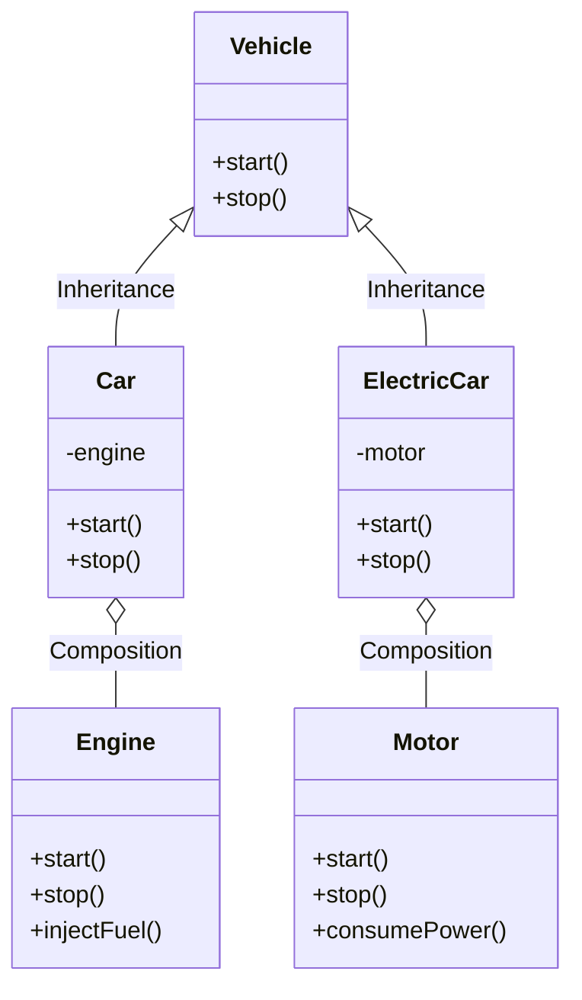

User: can you tell me about Composition Over Inheritance? also give real life examples, and diagrams

---

I'll explain Composition Over Inheritance using both programming and real-world examples, and create a diagram to illustrate the concepts.




Composition Over Inheritance is a fundamental design principle in object-oriented programming that suggests you should favor composing objects together rather than using inheritance hierarchies. Let me break this down:

1. The Core Concept:
- Instead of inheriting behaviors from parent classes, objects should contain instances of other classes that provide the desired functionality
- This creates a "has-a" relationship rather than an "is-a" relationship

2. Real-World Examples:

Example 1: Vehicle System
- Inheritance Approach:
  ```python
  class Vehicle:
      def move(self): pass
  
  class Car(Vehicle):
      def move(self):
          # Car-specific movement logic
          pass
  ```

- Composition Approach:
  ```python
  class Engine:
      def run(self): pass
  
  class Car:
      def __init__(self):
          self.engine = Engine()
      
      def move(self):
          self.engine.run()
  ```

Real-Life Analogy: Think about building a car
- Inheritance would be like saying "a car is a type of vehicle"
- Composition is like saying "a car has an engine, has wheels, has seats"

Example 2: Computer Assembly
- Instead of inheriting from a "Computer" class, a laptop is composed of:
  - CPU
  - RAM
  - Storage
  - Display
  - Keyboard

3. Advantages of Composition:

a) Flexibility
- Easy to change parts without affecting the whole system
- Can swap implementations at runtime
- Less rigid than inheritance hierarchies

b) Better Encapsulation
- Internal details can be hidden
- Changes to composed objects don't necessarily affect the containing object

c) Looser Coupling
- Components can be developed independently
- Easier to test and maintain

4. When to Use Each:

Use Inheritance When:
- There's a true "is-a" relationship
- You want to share code among several related classes
- The parent class is designed for extension

Use Composition When:
- You need more flexibility
- You want to reuse code across unrelated classes
- The relationship between classes might change
- You need to change behavior at runtime

5. Practical Example:
```python
# Composition example for a music player

class AudioPlayer:
    def __init__(self):
        self.equalizer = Equalizer()
        self.display = Display()
        self.storage = Storage()
    
    def play_music(self):
        audio = self.storage.get_audio()
        processed_audio = self.equalizer.process(audio)
        self.display.show_playing(audio.metadata)
```

This is more flexible than inheriting from a generic "MediaPlayer" class because:
- You can easily swap out the equalizer implementation
- The display can be changed without affecting other components
- Storage can be changed from local to cloud without changing the AudioPlayer class

Remember: "Favor composition over inheritance" doesn't mean "never use inheritance." It means composition should be your first choice, and inheritance should be used when it makes the most sense for your specific use case.

Would you like me to provide more examples or elaborate on any particular aspect of Composition Over Inheritance?

---

change code to java

---

I'll convert the examples to Java and expand on them to show more Java-specific patterns.


```java
// Core interfaces
interface Playable {
    void play();
    void stop();
}

interface StorageDevice {
    byte[] readData();
    void writeData(byte[] data);
}

// Component classes
class Equalizer {
    private int[] bands;
    
    public Equalizer() {
        this.bands = new int[10]; // 10-band equalizer
    }
    
    public void adjustBand(int band, int value) {
        if (band >= 0 && band < bands.length) {
            bands[band] = value;
        }
    }
    
    public byte[] processAudio(byte[] audio) {
        // Apply equalizer settings to audio
        return audio; // Simplified for example
    }
}

class Display {
    private boolean isOn;
    
    public void showNowPlaying(String title, String artist) {
        if (isOn) {
            System.out.println("Now Playing: " + title + " - " + artist);
        }
    }
    
    public void turnOn() {
        isOn = true;
    }
    
    public void turnOff() {
        isOn = false;
    }
}

class LocalStorage implements StorageDevice {
    private Map<String, byte[]> storage = new HashMap<>();
    
    @Override
    public byte[] readData() {
        // Implementation for reading from local storage
        return new byte[0];
    }
    
    @Override
    public void writeData(byte[] data) {
        // Implementation for writing to local storage
    }
}

// Main class using composition
class AudioPlayer implements Playable {
    private final Equalizer equalizer;
    private final Display display;
    private final StorageDevice storage;
    private boolean isPlaying;
    
    public AudioPlayer() {
        this.equalizer = new Equalizer();
        this.display = new Display();
        this.storage = new LocalStorage();
    }
    
    @Override
    public void play() {
        if (!isPlaying) {
            byte[] audioData = storage.readData();
            byte[] processedAudio = equalizer.processAudio(audioData);
            display.showNowPlaying("Current Track", "Artist");
            isPlaying = true;
        }
    }
    
    @Override
    public void stop() {
        if (isPlaying) {
            isPlaying = false;
            display.showNowPlaying("Stopped", "");
        }
    }
    
    public void adjustEqualizer(int band, int value) {
        equalizer.adjustBand(band, value);
    }
}

// Example of how composition allows for easy extension
class StreamingAudioPlayer extends AudioPlayer {
    private final NetworkClient networkClient;
    
    public StreamingAudioPlayer() {
        super();
        this.networkClient = new NetworkClient();
    }
    
    // Add streaming-specific functionality
    public void streamFromUrl(String url) {
        // Implementation
    }
}

// Example usage
public class Main {
    public static void main(String[] args) {
        AudioPlayer player = new AudioPlayer();
        player.adjustEqualizer(0, 5); // Adjust bass
        player.play();
        
        StreamingAudioPlayer streamingPlayer = new StreamingAudioPlayer();
        streamingPlayer.streamFromUrl("http://example.com/music.mp3");
    }
}

```

Let me explain the key differences and Java-specific features in this implementation:

1. Interface Usage
- We use interfaces (`Playable`, `StorageDevice`) to define contracts
- This is a common Java pattern that supports composition by allowing different implementations

2. Immutability
- Notice the `final` fields in the `AudioPlayer` class
- This ensures that the composed components cannot be changed after initialization

3. Encapsulation
- Private fields with public methods to access functionality
- Components are hidden from external code

4. Type Safety
- Java's static typing helps ensure that composed objects match their expected interfaces
- This provides compile-time safety for our composition

5. Extension Points
- The `StreamingAudioPlayer` shows how we can extend functionality while maintaining composition
- It adds new features without breaking the existing composition structure

Key Benefits of This Approach in Java:

1. Dependency Injection Ready
- The components can easily be injected through constructors
- Makes the code testable and maintainable

2. Interface Segregation
- Each component has a specific interface
- Follows the Interface Segregation Principle from SOLID

3. Runtime Flexibility
- Components can be swapped at runtime (e.g., changing storage implementation)
- Supports different configurations without code changes

4. Clean API
- The public interface is clear and well-defined
- Internal complexity is hidden behind simple interfaces

Would you like me to add more examples or elaborate on any specific aspect of the Java implementation?

---
