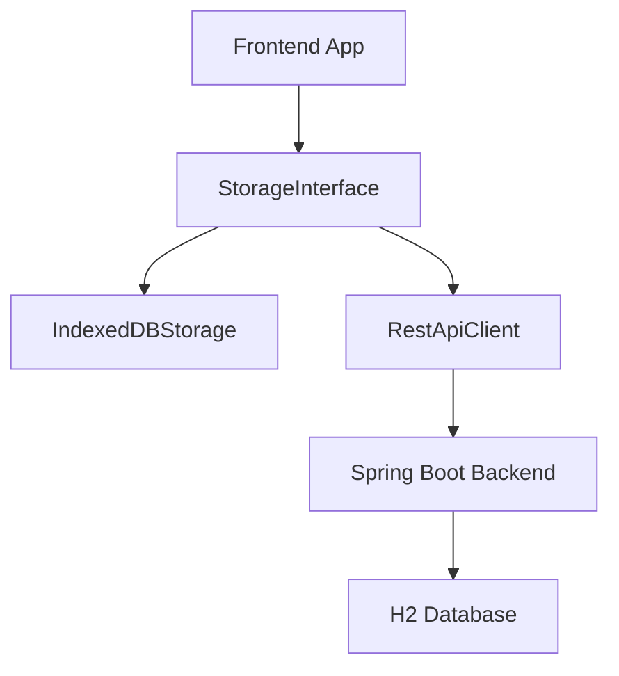

input to [bolt.new](https://bolt.new/) is below:

---

Please create boilerplate for:

*Insert project SRS here. Sample SRS is below*

---

- Backend in Java Spring Boot with gradle packaging (in Kotlin DSL). The backend code needs to be completed. Add comments as TODOs instead of writing the full code.
- Frontend in Preact with no build tools. Use only cdn packages. The frontend should be serve-able using a simple http server like python -m http.server or npx serve.
- Create clear interface for backend to be used by frontend.
IndexedDB implements that interface. Also, a stubbed js client to the backend implements it.
- The backend should have 2-3 entities and 1-2 relationships. The frontend should have a simple CRUD interface for these entities.
- The spring boot app should serve the frontend code as static files.

Technology:
- html, css, js without any build tools like vite / webpack.
- no typescript.
- no package manager like npm / yarn / bun.
- Use only cdn packages, with simple index.html, index.css, index.js , and a few other js files.
- Use preact with No-Build Workflows (Whilst build tools like Webpack, Rollup, and Vite are incredibly powerful and useful, Preact fully supports building applications without them.)
- The frontend should be servable using a simple http server like python -m http.server or npx serve.

---

Sample preact code with import maps

```html
<!DOCTYPE html>
<html>
  <head>
    <script type="importmap">
      {
        "imports": {
          "preact": "https://esm.sh/preact@10.23.1",
          "htm/preact": "https://esm.sh/htm@3.1.1/preact?external=preact"
        }
      }
    </script>
  </head>
  <body>
    <div id="app"></div>

    <script type="module">
      import { render } from 'preact';
      import { html } from 'htm/preact';

      export function App() {
        return html`<h1>Hello, World!</h1>`;
      }

      render(html`<${App} />`, document.getElementById('app'));
    </script>
  </body>
</html>
```

relationships between classes:



---

Sample project file structure 
.
├── main
│   ├── java
│   │   └── org
│   │       └── example
│   │           └── taskmanager
│   │               ├── TaskManagerApplication.java
│   │               ├── controller
│   │               │   ├── HelloController.java
│   │               │   └── TaskController.java
│   │               ├── model
│   │               │   └── Task.java
│   │               └── repository
│   │                   ├── TaskJdbcRepository.java
│   │                   └── TaskRepository.java
│   └── resources
│       ├── application.yaml
│       ├── schema.sql
│       └── static
│           ├── README.md
│           ├── index.html
│           ├── js
│           │   ├── app.js
│           │   ├── components
│           │   │   ├── TaskForm.js
│           │   │   └── TaskList.js
│           │   ├── context
│           │   │   └── TaskContext.js
│           │   └── services
│           │       ├── IndexedDBStorage.js
│           │       ├── RestApiClient.js
│           │       ├── TaskStorageInterface.js
│           │       └── taskService.js
│           └── styles.css

---
application.yaml

spring:
  application:
    name: TaskManager
  datasource:
    url: jdbc:h2:file:./h2
    username: user
    password: pass
    driver-class-name: org.h2.Driver
  h2:
    console:
      enabled: true
      path: /h2-console
  sql:
    init:
      mode: always

------

Sample projects are below:

------

Here are **10 project ideas** without a `User` entity, where the backend is stubbed out, and the frontend is built using **React + Bolt.new**, with Java as the backend:

---

### 1. **Task Assignment System**  
   - **Entities**: `Task`, `Worker`  
   - **Relationships**: A `Worker` is assigned multiple `Tasks`  
   - **Functionality**: Assign, track, and complete tasks for different workers.  

### 2. **Library Management System**  
   - **Entities**: `Book`, `Author`  
   - **Relationships**: An `Author` writes multiple `Books`  
   - **Functionality**: Search, categorize, and manage books with author details.  

### 3. **Event Scheduling System**  
   - **Entities**: `Event`, `Venue`  
   - **Relationships**: A `Venue` hosts multiple `Events`  
   - **Functionality**: Schedule, reschedule, and track events at different venues.  

### 4. **Product Inventory System**  
   - **Entities**: `Product`, `Category`  
   - **Relationships**: A `Category` contains multiple `Products`  
   - **Functionality**: Manage stock levels, add/remove products, and filter by category.  

### 5. **Student Course Registration**  
   - **Entities**: `Student`, `Course`  
   - **Relationships**: A `Student` enrolls in multiple `Courses`  
   - **Functionality**: Students register for courses, drop them, and view their schedule.  

### 6. **Movie Review System**  
   - **Entities**: `Movie`, `Review`  
   - **Relationships**: A `Movie` has multiple `Reviews`  
   - **Functionality**: Add reviews, rate movies, and browse ratings.  

### 7. **Appointment Booking System**  
   - **Entities**: `Appointment`, `TimeSlot`  
   - **Relationships**: An `Appointment` is scheduled within a `TimeSlot`  
   - **Functionality**: Book, reschedule, and cancel appointments.  

### 8. **Voting and Polling System**  
   - **Entities**: `Poll`, `Option`, `Vote`  
   - **Relationships**: A `Poll` has multiple `Options`, and each `Option` can receive `Votes`  
   - **Functionality**: Create polls, vote, and see results.  

### 9. **Expense Tracking System**  
   - **Entities**: `Expense`, `Category`  
   - **Relationships**: An `Expense` belongs to a `Category`  
   - **Functionality**: Log expenses, categorize them, and view spending reports.  

### 10. **E-commerce Cart System**  
   - **Entities**: `Product`, `CartItem`  
   - **Relationships**: A `CartItem` is linked to a `Product`  
   - **Functionality**: Add/remove items from the cart and manage quantities.  

---

Each project will have:  
✅ **React frontend** (generated using Bolt.new)  
✅ **Stubbed Java backend** (REST API contract defined, implementation missing)  
✅ **IndexedDB/In-memory storage** for the initial working UI  

Would you like me to generate code stubs for any of these?
