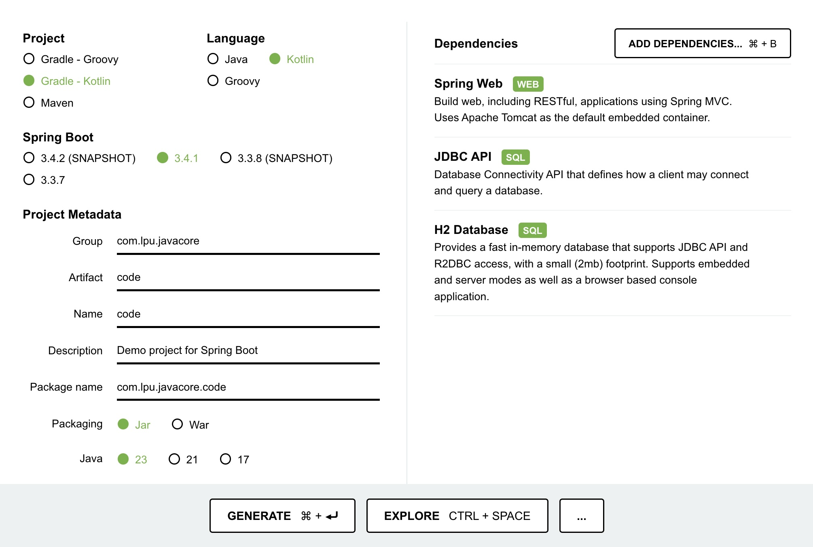

### Day 3

<div class="pt-12">
  <span @click="$slidev.nav.next" class="px-2 py-1 rounded cursor-pointer" flex="~ justify-center items-center gap-2" hover="bg-white bg-opacity-10">
    Press Space for next page <div class="i-carbon:arrow-right inline-block"/>
  </span>
</div>

---
layout: default
---

# Table of contents


<Toc maxDepth="1"></Toc>

---

### Agenda

- Compilation and Running process
- Compiled vs Interpreted languages
- On top of JVM what languages are popular and used where?
- Packaging / modules in Java (vs other programming languages)

---

## Compilation and running process

Computer needs assembly code to be run on the CPU.
Assembly language is a low level language that can be directly understood by the computer.
Different levels of abstration were built with the pass of time.

Newer languages with higher levels of abstration gradually came to the market.

- Golang is beginner friendly syntax, and we are getting higher traction in backend code development using this language.
- Rust is very efficient, but it's not a beginner-friendly. Memory-safe language compared to C/C++.
- Swift is used by Apple for creating apps. It can also be used to write backend code. It's one of the most elegant languages.
- Kotlin syntax is similar to Swift (some features were influenced from Swift). It runs on JVM.

---

## Compiled languages

- A code in C / C++ / Golang / Rust
- Compiler will take the code as input and output a binary.
- This binary can **only** be executed on 
   + the same OS
   + the same CPU architecture.
  OS : Mac, Linux, Windows, BSD, Android, IOS, Arduino, etc.
  CPU: Raspberry Pi, Intel, AMD, ARM, ARM64, etc. AARCH.
  We cannot run a binary meant to be run on (CPU C1, OS O1) on a different machine (C2, O2).

---

## Interpreted languages

- A code
- Interpreter always requires a 2-step process.
- First step: Src Code -> Byte Code.
  This is done by compiler.
- Second step: Byte Code -> Machine Code.
  This is done by interpreter. (JIT compiler / JVM)
  This causes the program to run on any machine that has an interpreter.

---

## How a Java code is ultimately executed by the device.

Java is neither completely compiled nor interpreted. It's a mix of both.
- Java code is compiled to bytecode using `javac`.
- Bytecode is then interpreted by JVM (JIT compiler) which in turn generates machine code for the CPU.
- Typically compiled / half-compiled languages are faster than interpreted languages. The whole reason being that the compiler can efficiently using the stack in function calls.

---

## Paradigms

- Functional programming.
  Example: Haskell, Lisp, Clojure, Scala
- Procedural programming.
  + C, C++, Java, Python, Ruby, PHP, JavaScript, Go, Rust, etc.
- Structured Queries (SQL)

---

## On top of JVM what languages are popular and used where?

Some other languages that run on the JVM:

- Kotlin (Procedural programming language)
- Scala (Procedural programming language)
- Clojure (Functional programming language)

---

## SDK

Software Development Kit
- A set of APIs and libraries to develop software.
- It's a collection of classes, interfaces, methods, etc. that are used by the application.

## API

Application Programming Interface
- During the programming process, how will you use a 3rd party program to do something?
Types of API:
- RESTful APIs
- RPC APIs

--

## 3rd Party Package Consumption (dependency consumption) registries

Web developers:
- Node.js (npm registry) / Deno.js (JSR registry) / Bun.js

Rust developers - Cargo
- Python: pypi.org, conda-forge, etc.

Go: Directly downloaded from some git server. You can specify the git commit hash / git tag.

---

## Shared Library (.so , .dll)

Shared Library is compiled code which can be used in that particular OS and CPU arch.
- Statically linked: The library is included with the executable file, so it's not loaded at runtime.
- Dynamically linked: The library is separate from the executable file, so it's loaded at runtime.

---

## Dependency Management

- Some tool provided by the programming language is responsible for dependency management. (npm, pnpm, yarn ; cargo ; pip).
- Packages are downloaded and saved in the context of either:
  + Local source code (Nodejs).
  + Global system (python / golang).

Java uses `JAR` files for software distribution. JAR files should contain .class files.

---

## Configuration file(s) for dependency management.

node / bun: `package.json`
python: `requriements.txt`
rust: `Cargo.toml`.
java: `pom.xml`

It saves the list of all the dependencies and the project metadata in a single file.

---

## How dependency tree is computed and stored?

- Dependency tree is computed by parsing the configuration files.

Computation is done in greedy mode.
+ The first level of dependencies are added to the list.
+ Then, for each dependency, we check if it has already been added to the list or not.
  + If yes, then we skip that dependency and move on to the next one.
  + If no, then we add it to the list.
+ We repeat this process until all dependencies are added to the list.

---

### Dependency Resolution failure

Dependency resolver will fail to resolve to a particular version of a package if their is disjoint range of versions required for that package.

Example:

- Package a (1.2) requires x >= 1.0
- Package b (1.3) requires x < 0.8

We have disjoint interval here, so we cannot resolve to any version of the package `x`.
+ The package manager can either choose to ignore this dependency or throw an error.

---

### Lockfiles

Lockfile contains:
- Resolved versions of direct and transitive dependencies
- The download location for each dependency
- The hash of the downloaded file

node / bun: `package-lock.json`
go: `go.sum`

**Python does not officially provide any locakfile management system**.
But there are multiple 3rd party tools for python to manage lockfiles.
+ [pipenv](https://github.com/pypa/pipenv)
+ [poetry](https://python-poetry.org/)

 ---

### Dependency Management in Java

There are multiple tools which can be used to manage dependencies:
- Maven (since Java 1.5)
- Gradle (since Java 6)
- Bazel (since Java 8)

Each one has their own configuration file, but the underlying concept is similar.
- Maven uses a file called `pom.xml` to define all of its dependencies and configurations.
The configuration language is `XML` **which is not very human readable.**
- Gradle can use any of these languages for configuration ([domain specific language](https://www.google.com/search?q=domain+specific+language)):
   + Groovy (since Java 1.9)
   + Kotlin (since Java 8)
  These are much more human readable compared to `XML`.

---

### Generate boilerplate of starter project in Java

To get samples of the config files / starter project:
1. visit https://start.spring.io/
2. make the selection and click on generate.
    
    

---
zoom: 0.65
---

### Sample gradle dependency file (in Kotlin DSL)

```kotlin
plugins {
	kotlin("jvm") version "1.9.25"
	kotlin("plugin.spring") version "1.9.25"
	id("org.springframework.boot") version "3.4.1"
	id("io.spring.dependency-management") version "1.1.7"
}

group = "com.lpu.javacore"
version = "0.0.1-SNAPSHOT"

java {
	toolchain {
		languageVersion = JavaLanguageVersion.of(21)
	}
}

repositories {
	mavenCentral()
}

dependencies {
	implementation("org.springframework.boot:spring-boot-starter-jdbc")
	implementation("org.springframework.boot:spring-boot-starter-web")
	implementation("com.fasterxml.jackson.module:jackson-module-kotlin")
	implementation("org.jetbrains.kotlin:kotlin-reflect")
	runtimeOnly("com.h2database:h2")
	testImplementation("org.springframework.boot:spring-boot-starter-test")
	testImplementation("org.jetbrains.kotlin:kotlin-test-junit5")
	testRuntimeOnly("org.junit.platform:junit-platform-launcher")
}

kotlin {
	compilerOptions {
		freeCompilerArgs.addAll("-Xjsr305=strict")
	}
}

tasks.withType<Test> {
	useJUnitPlatform()
}
```

---

### Meaning of all these functions

- kotlin("jvm") - Applies Kotlin plugins maintained by JetBrains
- id("org.springframework.boot") - Applies third-party plugins by their ID

```kotlin
// Regular compile and runtime dependency
implementation(...)
// Only needed at runtime, not for compilation
runtimeOnly(...)
// Dependency only for test compilation and execution
testImplementation(...)
// Dependency only for test runtime
testRuntimeOnly(...)
```

---
zoom: 0.8
---

### Sample Maven project

Maven uses XML. This is the maven `pom.xml` file for the same starter project:

```xml
<?xml version="1.0" encoding="UTF-8"?>
<project xmlns="http://maven.apache.org/POM/4.0.0" xmlns:xsi="http://www.w3.org/2001/XMLSchema-instance"
	xsi:schemaLocation="http://maven.apache.org/POM/4.0.0 https://maven.apache.org/xsd/maven-4.0.0.xsd">
	<modelVersion>4.0.0</modelVersion>
	<parent>
		<groupId>org.springframework.boot</groupId>
		<artifactId>spring-boot-starter-parent</artifactId>
		<version>3.4.1</version>
		<relativePath/> <!-- lookup parent from repository -->
	</parent>
	<groupId>com.lpu.javacore</groupId>
	<artifactId>code</artifactId>
	<version>0.0.1-SNAPSHOT</version>
	<name>code</name>
	<description>Demo project for Spring Boot</description>
	<url/>
	<licenses>
		<license/>
	</licenses>
	<developers>
		<developer/>
	</developers>
	<scm>
		<connection/>
		<developerConnection/>
		<tag/>
		<url/>
	</scm>
	<properties>
		<java.version>21</java.version>
		<kotlin.version>1.9.25</kotlin.version>
	</properties>
	<dependencies>
		<dependency>
			<groupId>org.springframework.boot</groupId>
			<artifactId>spring-boot-starter-jdbc</artifactId>
		</dependency>
		<dependency>
			<groupId>org.springframework.boot</groupId>
			<artifactId>spring-boot-starter-web</artifactId>
		</dependency>
		<dependency>
			<groupId>com.fasterxml.jackson.module</groupId>
			<artifactId>jackson-module-kotlin</artifactId>
		</dependency>
		<dependency>
			<groupId>org.jetbrains.kotlin</groupId>
			<artifactId>kotlin-reflect</artifactId>
		</dependency>
		<dependency>
			<groupId>org.jetbrains.kotlin</groupId>
			<artifactId>kotlin-stdlib</artifactId>
		</dependency>

		<dependency>
			<groupId>com.h2database</groupId>
			<artifactId>h2</artifactId>
			<scope>runtime</scope>
		</dependency>
		<dependency>
			<groupId>org.springframework.boot</groupId>
			<artifactId>spring-boot-starter-test</artifactId>
			<scope>test</scope>
		</dependency>
		<dependency>
			<groupId>org.jetbrains.kotlin</groupId>
			<artifactId>kotlin-test-junit5</artifactId>
			<scope>test</scope>
		</dependency>
	</dependencies>

	<build>
		<sourceDirectory>${project.basedir}/src/main/kotlin</sourceDirectory>
		<testSourceDirectory>${project.basedir}/src/test/kotlin</testSourceDirectory>
		<plugins>
			<plugin>
				<groupId>org.springframework.boot</groupId>
				<artifactId>spring-boot-maven-plugin</artifactId>
			</plugin>
			<plugin>
				<groupId>org.jetbrains.kotlin</groupId>
				<artifactId>kotlin-maven-plugin</artifactId>
				<configuration>
					<args>
						<arg>-Xjsr305=strict</arg>
					</args>
					<compilerPlugins>
						<plugin>spring</plugin>
					</compilerPlugins>
				</configuration>
				<dependencies>
					<dependency>
						<groupId>org.jetbrains.kotlin</groupId>
						<artifactId>kotlin-maven-allopen</artifactId>
						<version>${kotlin.version}</version>
					</dependency>
				</dependencies>
			</plugin>
		</plugins>
	</build>

</project>

```

