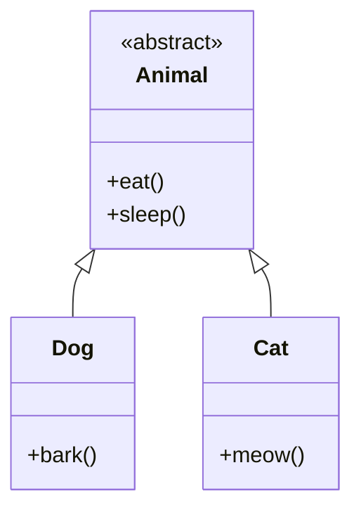
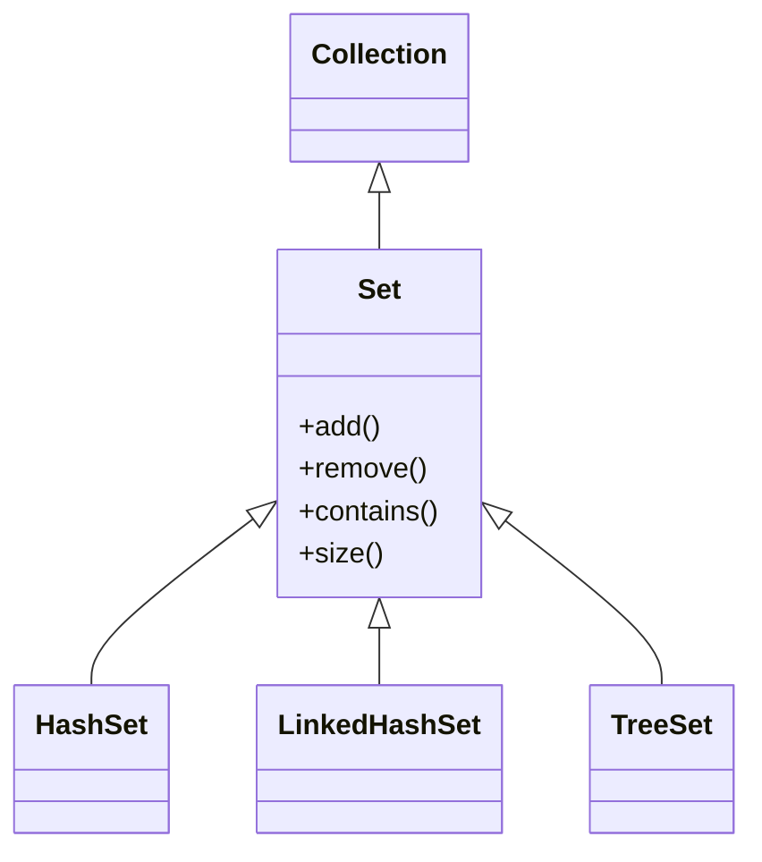

# Day 5

## There is no magic, every convenience is just an abstraction

<div class="pt-12">
  <span @click="$slidev.nav.next" class="px-2 py-1 rounded cursor-pointer" flex="~ justify-center items-center gap-2" hover="bg-white bg-opacity-10">
    Press Space for next page <div class="i-carbon:arrow-right inline-block"></div>
  </span>
</div>

---
layout: default
---

## Table of contents

<Toc columns=3></Toc>

---

## Counting Towers

```java
import java.util.HashMap;
import java.util.Scanner;

public class CountingTowers {
    static HashMap<Long, TotalWays> dp = new HashMap<>();
    static long mod = 1000000007;

    // TotalWays is the count of total number of ways we can
    // construct a tower of height n.
    // width 1 ends with length 1,1. 🟩🟥
    // width 2 ends with 2. 🟩🟩
    static class TotalWays {
        long width1;
        long width2;

        TotalWays(long width1, long width2) {
            this.width1 = width1;
            this.width2 = width2;
        }

        @Override
        public String toString() {
            return "width1: " + width1 + " width2: " + width2;
        }

    }

    static TotalWays solve(long n) {
        if (n==1) return new TotalWays(1, 1);

        // memoize
        if (dp.containsKey(n)) {
            return dp.get(n);
        }

        // Ways in which we can solve n-1 height tower.
        var prev = solve(n-1);

        // Level: N
        // Level: N-1

        /*
          🟪🟦      🟪🟦  🟥🟪  🟦🟩  🟥🟩 // Level N
          🟥🟥      🟥🟩  🟥🟩  🟥🟩  🟥🟩 // Level N-1
        */

        var withWidth1 = (prev.width1 * 4 + prev.width2) % mod;

        /*
          🟦🟦  🟥🟥      🟦🟦  // Level N
          🟥🟥  🟥🟥      🟥🟪  // Level N-1
        */
        var withWidth2 = (prev.width1 + prev.width2 * 2) % mod;
        var res = new TotalWays(withWidth1, withWidth2);
        dp.put(n, res);
        return res;
    }

    public static void main(String[] args) {
        var sc = new Scanner(System.in);
        var testcases = sc.nextLong();
        for (long i = 0; i < testcases; i++) {
            var height = sc.nextLong();
            var res = solve(height);
            System.out.println((res.width1 + res.width2) % mod);
        }
    }
}
```

---

## Agenda

- Java APIs (STL, syntax and more) (part 1)

---

## Namespace

- It's a group.
- In Java, the first level of group is the package.

---

## Access modifier

- Access modifiers: `public`, `protected`, `private`, `default`


Here's a breakdown of Java's access modifiers and their visibility levels:

| Modifier | Class | Package | Subclass | World |
|----------|--------|----------|-----------|--------|
| private | ✓ | ✗ | ✗ | ✗ |
| default (no modifier) | ✓ | ✓ | ✗ | ✗ |
| protected | ✓ | ✓ | ✓ | ✗ |
| public | ✓ | ✓ | ✓ | ✓ |

---

## Object Oriented Programming

- There is blueprint called class.
- From each blueprint, we can create concrete stuff called objects.

---

## Static / final keyword

Attributes which are associated with the class.

```java
class Car {
    enum Color {
        Red,
        Green,
        Blue
    }

    Color color;
    int seatCount;
    final static int wheelCount = 4;

    Car(Color color, int seatCount) {
        this.color = color;
        this.seatCount = seatCount;
    }

}

public class CarExample {

    public static void main(String[] args) {
        var c = new Car(Car.Color.Blue, 4);
        System.out.println(Car.wheelCount);
//        Car.wheelCount = 10;
    }
}
```

---

## Static / Non-static

```java
class Car {
    enum Color {
        Red,
        Green,
        Blue
    }

    String model;
    Color color;
    int seatCount;
    final static int wheelCount = 4;

    Car(String model, Color color, int seatCount) {
        this.model = model;
        this.color = color;
        this.seatCount = seatCount;
    }

}

public class CarExample {
    
    static int stat;
    int nonStat;
    
//    CarExample() {
//        
//    }
    
    public void methodNonStat() {
        
    }
    
    public static void methodStat() {
        
    }
    
    public void nonStatic() {
        var x = stat; // this works
        var y = this.stat; // redundant this
        methodStat();
        this.methodStat(); // redundant this
        this.methodNonStat();
    }

    public static void staticMethod() {
        var x = stat; // this works
//        var y = this.stat; // this does not work
        methodStat();
//        this.methodStat(); // not work
//        this.methodNonStat();
    }

    public static void main(String[] args) {
        var bmw = new Car("BMW", Car.Color.Blue, 4);
        System.out.println(Car.wheelCount);

        var lambo = new Car("Lambo", Car.Color.Red, 6);
        System.out.println(Car.wheelCount);
//        Car.wheelCount = 10;

        var obj = new CarExample();
        var x = obj.nonStat;
        
        // this will not work:
        // this.xyz
    }
}
```

### Observations on Static

- What is static?
  - It's a keyword that is associated with the class.
  - Definition: A static attribute is associated with the blueprint, i.e., the class. Each object does not have its own copy of the static attribute.
- Non-static attributes are associated with the object. Each object has its own copy of the non-static attribute. 

- Static and Non-static inter-accessibility table:

| Can Access → <br>From ↓ | Static Methods | Static Variables | Non-Static Methods | Non-Static Variables |
|-------------------------|----------------|------------------|-------------------|---------------------|
| Static Methods | ✓ | ✓ | ✗ | ✗ |
| Non-Static Methods | ✓ | ✓ | ✓ | ✓ |

Key Points:
- Static members belong to the class itself
- Non-static members belong to specific instances
- Static methods can't directly access non-static members because there's no instance context
- Non-static methods can access static members because static members are shared across all instances

---

## Polymorphism

- Polymorphism is the ability of an object to take on many forms.
- There are two types of polymorphism in Java: compile-time polymorphism and runtime polymorphism.
  + Compile-time polymorphism is method overloading.
  + Runtime polymorphism is method overriding.

---

## Method Overloading

- Method overloading is a feature that allows a class to have more than one method having the same name, if their argument lists are different.
- It is similar to constructor overloading in Java, that allows a class to have more than one constructor having different argument lists.
- Overloading cannot differ in return type alone.

```java
// example of a method overloading related to sum
class Sum {
    int sum(int a, int b) {
        return a + b;
    }

    int sum(int a, int b, int c) {
        return a + b + c;
    }

    double sum(double a, double b) {
        return a + b;
    }

    public static void main(String[] args) {
        Sum s = new Sum();
        System.out.println(s.sum(10, 20)); // 30
        System.out.println(s.sum(10, 20, 30)); // 60
        System.out.println(s.sum(10.5, 20.5)); // 31.0
    }
}
```

- We will cover more on method overriding after introducing inheritance.

---

## Inheritance

- Inheritance is a mechanism in which one class acquires the properties and behavior of another class.
- Inheritance from multiple parent classes is not allowed in Java.
  `class C extends A, B {` is not allowed in Java. 
- Example:



---

## What happens in Inheritance

- The class that is inherited is called the parent class, superclass
- The class that does the inheriting is called the child class, subclass
- The child class inherits all the properties and behavior of the parent class
- The child class can extend the behavior of the parent class
- The child class can **override** the behavior of the parent class
- Typically parent class can describe a more generic behavior, and child class can describe a more specific behavior.

---

## Inheritance Example

```java
class Animal {
    void eat() {
        System.out.println("eating...");
    }
}

class Dog extends Animal {
    void bark() {
        System.out.println("barking...");
    }
}

class TestInheritance {
    public static void main(String[] args) {
        Dog d = new Dog();
        d.bark();
        d.eat();
    }
}
```

---

## Inheritance (contd.)

In the above example, `eat` method is inherited from the parent class `Animal` by the child class `Dog`.
- The child class `Dog` can override the behavior of the parent class `Animal`.

---

## Method Overriding

- Method overriding is a feature that allows a subclass or child class to provide a specific implementation of a method that is already provided by one of its super-classes (a.k.a. parent classes).
- **All classes implicitly inherit from the `Object` class.**

---

## Method Overriding Example

```java
import java.util.Scanner;

class A {

}

class B {

}

//class C extends A, B {
//
//}

class Animal {
    void eat() {
        System.out.println("eating...");
    }
}

class Dog extends Animal {
    void eat() {
        System.out.println("eating bread...");
    }
}

class Cat extends Animal {
    void eat() {
        System.out.println("eating fish...");
    }
}

public class Overriding {
    public static void main(String[] args) {
        Dog d = new Dog();
        d.eat();

        Scanner sc = new Scanner(System.in);
        var str = sc.next();

        Animal a = null;
        if (str.charAt(0) == 'a') {
            a = new Animal();
        } else if (str.charAt(0) == 'd') {
            a = new Dog();
        } else if (str.charAt(0) == 'c') {
            a = new Cat();
        }

        a.eat();

//      Dog b = new Animal(); // this won't work.
    }
}

```

---

## Abstract Class

- An abstract class is a class that is declared abstract—it may or may not include abstract methods.
- Abstract classes cannot be instantiated, but they can be subclassed.
- When an abstract class is subclassed, the subclass **usually** provides implementations for all of the abstract methods in its parent class. In some cases, the subclass may be declared abstract itself.
- Abstract classes can have constructors.

---

## Abstract Class Example

```java
abstract class Animal {
    abstract void eat();
    void sleep() {
        System.out.println("sleeping...");
    }
}

class Dog extends Animal {
    void eat() { // Must be implemented
        System.out.println("eating bread...");
    }
}

abstract class Mammal extends Animal {
    abstract void walk();
}
```

---

## Interface

- An interface is a reference type in Java. It is similar to abstract class because it cannot be instantiated. However, we cannot have any method implementations in an interface, in contrast to abstract classes.
- A class implements an interface, thereby inheriting the abstract methods of the interface.
- Along with abstract methods, an interface may also contain constants, default methods, static methods, and nested types.

---

## Interface Example

```java
interface Animal {
    void eat();
    void sleep();
}

class Dog implements Animal {
    public void eat() {
        System.out.println("eating bread...");
    }
    public void sleep() {
        System.out.println("sleeping...");
    }
}
```

---

## Interface and Abstract (contd.)

```java
public class Interface {

    class Organism {
        int lifespan;
    }

    interface Animal {
        void eat();
        void sleep();
    }

    interface Dangerous {
        void attack();
        void sleep();
    }

    class Dog extends Organism implements Animal, Dangerous {
        public void eat() {
            System.out.println("eating bread...");
        }
        public void sleep() {
            System.out.println("sleeping...");
        }

        public void attack() {
            System.out.println("attack...");
            var z = this.lifespan;
        }
    }
}
```

---

## Collections - Set

- A set is a collection that contains no duplicate elements.
- Lookup, insertion, and removal are all O(1) on average.
- Set is a generic interface that extends the Collection interface.


