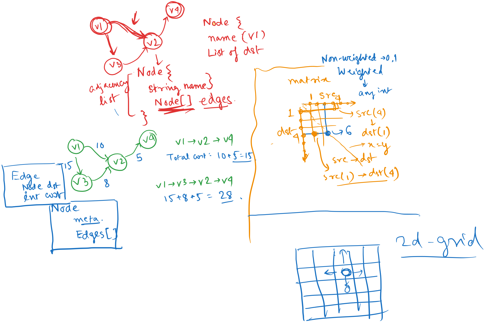
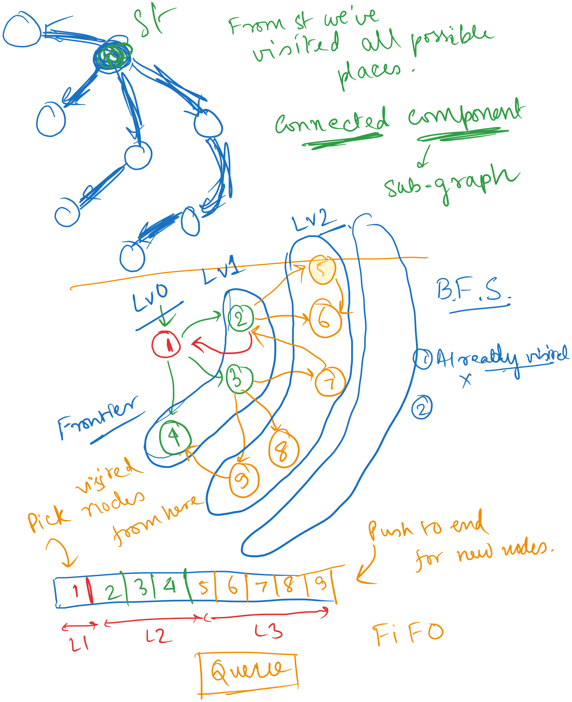
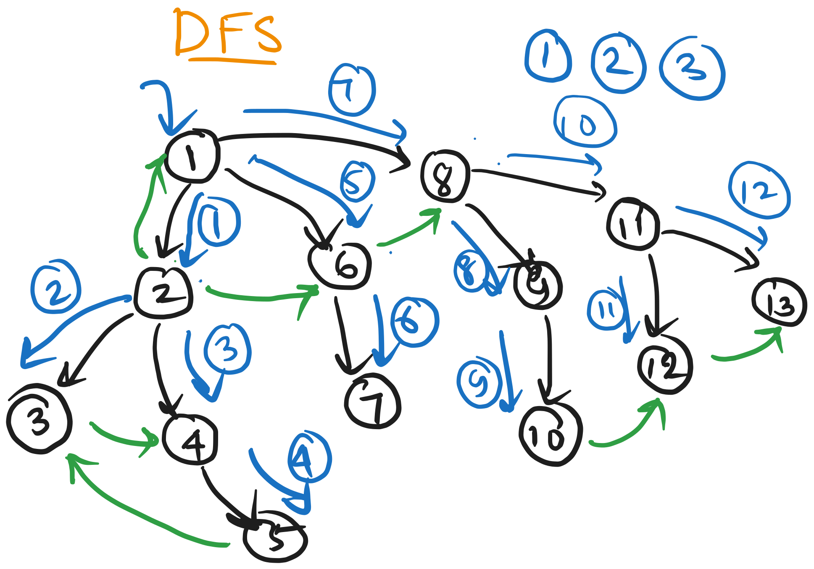
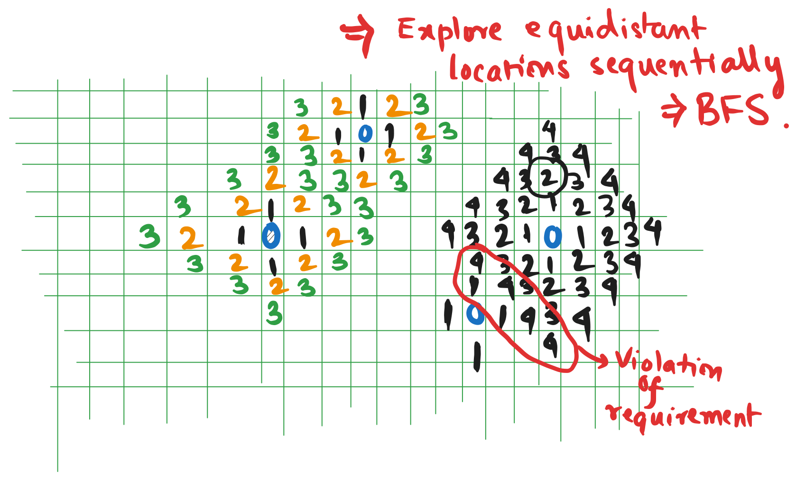

# Day 8

DeepSeek Reasoning Model released, which rivals OpenAI O1.

https://youtu.be/-2k1rcRzsLA?si=TEfb-UHasQRD0w_p

  
    Press Space for next page 

  

---
layout: default
---

## Table of contents

<Toc columns=3></Toc>

---

## Agenda

- Graphs
- BFS
- DFS
- Dijkstra's Algorithm
- Grid Questions
- Other leetcode questions

---

## Graphs

- Inside graphs:
  + There are entities called nodes. A node can have some metadata associated with itself.
  + There are relationships in between the nodes, represented by edges. An edge can also have some metadata associated with itself. The relationship can either be reciprocative (both-ways) or non-reciprocative.
    * When all relations in a graph are both ways, graph can be represented in undirected fashion.
    * When some relations are one way, graph can be represented in directed fashion.
- Graphs can have cycles. A cycle is a path that starts and ends at the same node, and contains at least one edge.
- Graphs can be connected or disconnected. A graph is connected if there is a path between every pair of nodes.
- One common metadata associated with an edge is called cost. The cost can be a number, or a string, or any other data type. The cost can represent the distance between two nodes, or the time taken to travel from one node to another, or any other metric.

---

## Repn.

---

## Adjacency List and Matrix

[Graph src code](../../cses/src/collections/Graph.java)

---

## Graph Traversal

- Traversing a graph means visiting all the nodes of a graph.
- There are two standard methods to traverse a graph:
  + Breadth First Search (BFS)
  + Depth First Search (DFS)
- Uses of traversal:
  + Finding connected components
  + Finding shortest path
  + Detecting cycle
  + Topological sorting
  + Finding strongly connected components
- BFS is going as wide as possible while travelling.
- DFS is going as deep as possible while travelling.

---

## BFS

[src code](../../cses/src/collections/GraphTraversal.java)

---

## DFS

[src code](../../cses/src/collections/GraphTraversal.java)

---

## Map of Highest Peak - Leetcode

https://leetcode.com/problems/map-of-highest-peak/

[src code](../../cses/src/leetcode/daily/MapOfHighestPeak.java)

