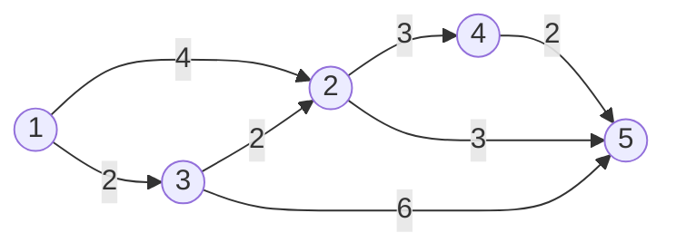
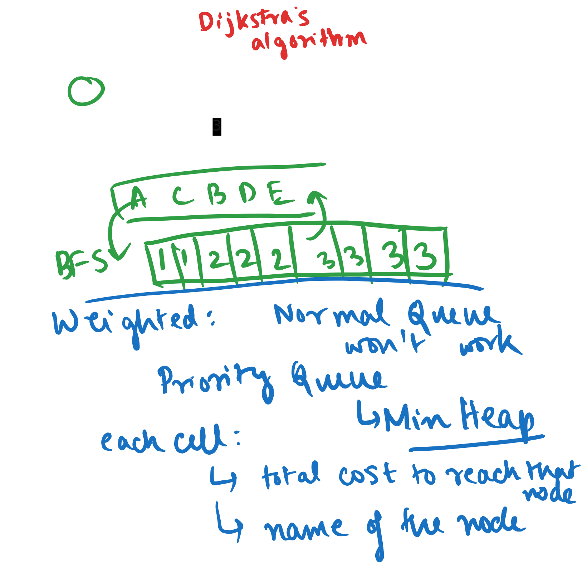
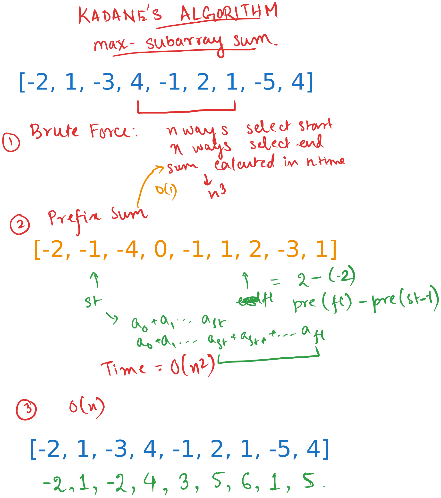
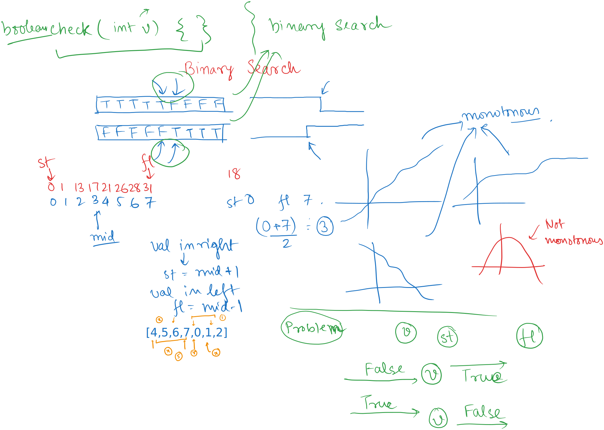

# Day 9

  
    Press Space for next page 

  

---
layout: default
---

## Table of contents

<Toc columns=3></Toc>

---

## Agenda

- Dijkstra's Algorithm
- Kadane's Algorithm
- Grid Questions
- Other leetcode questions
- Leetcode Daily Question

---

## Dijkstra's Algorithm

[src code](../../cses/src/collections/Dijkstra.java)

## Kadane's Algorithm

[src code](../../cses/src/collections/Kadane.java)

---

## Today's Leetcode

https://leetcode.com/problems/count-servers-that-communicate/description/?envType=daily-question&envId=2025-01-23

---

## Valid Parenthesis

https://leetcode.com/problems/valid-parentheses/description/

[src code](../../cses/src/leetcode/ValidParenthesis.java)

---

## Generate Parenthesis

https://leetcode.com/problems/generate-parentheses/description/

---

## Binary Search

---

## Binary Search Application

Time complexity of Binary Search: `O(log (n))`
In some problems, we need to do the following:
- Search for a value of `n` within the range `x` to `y`. Time complexity to search for the value becomes `O(log(y-x))`, i,e., `O(log(range of the possible values))`.
- For each value of `n`, we can check if `n` satisfies some condition in `O(m)` time.
- The overall complexity becomes `O(log(range) * m)`.
- We'll look into concrete examples.

---

## Binary Search Problems

Reference: https://cp-algorithms.com/num_methods/binary_search.html

*   [LeetCode - Find First and Last Position of Element in Sorted Array](https://leetcode.com/problems/find-first-and-last-position-of-element-in-sorted-array/)
*   [LeetCode - Search Insert Position](https://leetcode.com/problems/search-insert-position/)
*   [LeetCode - First Bad Version](https://leetcode.com/problems/first-bad-version/)
*   [LeetCode - Valid Perfect Square](https://leetcode.com/problems/valid-perfect-square/)
*   [LeetCode - Find Peak Element](https://leetcode.com/problems/find-peak-element/)
*   [LeetCode - Search in Rotated Sorted Array](https://leetcode.com/problems/search-in-rotated-sorted-array/)
*   [LeetCode - Find Right Interval](https://leetcode.com/problems/find-right-interval/)

---

# 33. Search in Rotated Sorted Array

https://leetcode.com/problems/search-in-rotated-sorted-array/

[src code](../../cses/src/leetcode/FindInRotatedSorted.java)

---

## Homework (Tomorrow)

- https://cses.fi/problemset/task/1620
- https://cses.fi/problemset/task/1085