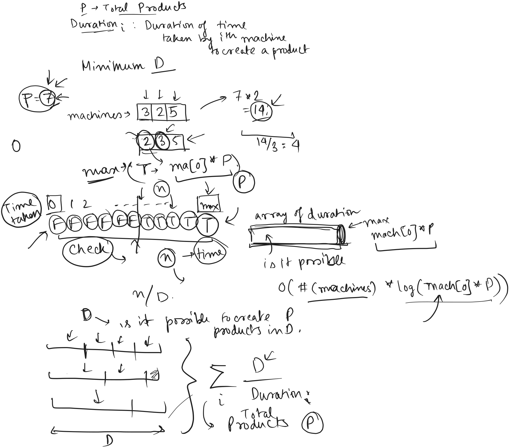
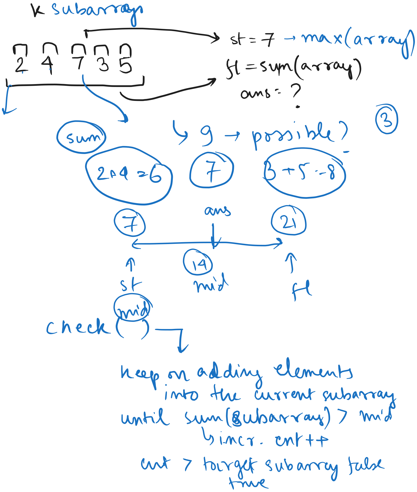

# Day 10


<div class="pt-12">
  <span @click="$slidev.nav.next" class="px-2 py-1 rounded cursor-pointer" flex="~ justify-center items-center gap-2" hover="bg-white bg-opacity-10">
    Press Space for next page <div class="i-carbon:arrow-right inline-block"/>
  </span>
</div>

---
layout: default
---

## Table of contents

<Toc columns=3></Toc>

---

## Agenda

- Binary Search Questions
- Leetcode Daily

---

## Factory Machines

https://cses.fi/problemset/task/1620

A factory has n machines which can be used to make products. Your goal is to make a total of t products.

For each machine, you know the number of seconds it needs to make a single product. The machines can work simultaneously, and you can freely decide their schedule.

What is the shortest time needed to make t products?

### Input

The first input line has two integers n and t: the number of machines and products.
The next line has n integers `k_1,k_2,...,k_n`: the time needed to make a product using each machine.

### Output

Print one integer: the minimum time needed to make t products.
Constraints

```
1 <= n <= 2 * 10^5
1 <= t <= 10^9
1 <= k_i <= 10^9
```

### Example

Input:
```
3 7
3 2 5
```

Output:
```
8
```

Explanation: Machine 1 makes two products, machine 2 makes four products and machine 3 makes one product.

---

## Factory Machines (Explanation)

[src code](../../code/src/cses/FactoryMachines.java)



---

## Array Division

https://cses.fi/problemset/task/1085

[src code](../../code/src/cses/ArrayDivision.java)


