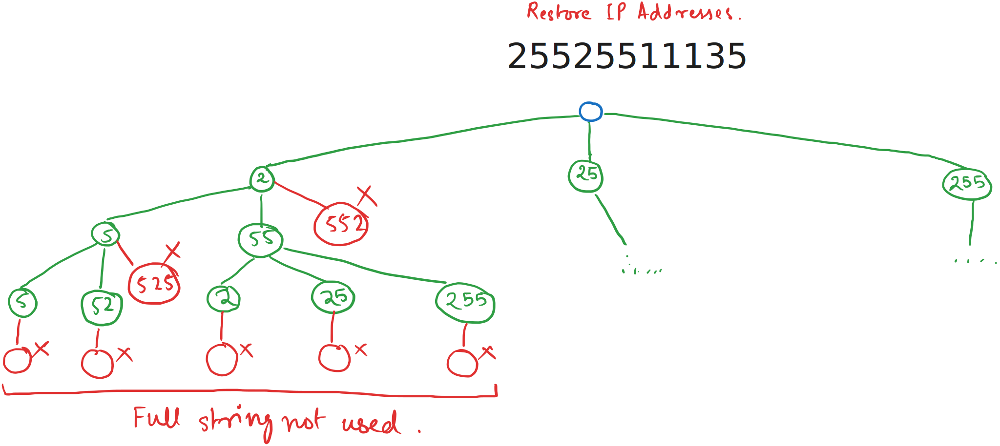

# Day 11

  
    Press Space for next page 

  

---
layout: default
---

## Table of contents

<Toc columns=3></Toc>

---

## Agenda

- Backtracking
- Backtracking problems:
  + [78. Subsets](https://leetcode.com/problems/subsets/description/)
  + [17. Letter Combinations of a Phone Number](https://leetcode.com/problems/letter-combinations-of-a-phone-number/description)
  + [93. Restore IP Addresses](https://leetcode.com/problems/restore-ip-addresses/description/)
- Meet in the middle
- Meet in the middle problems:
  + [1690. Stone Game VII](https://leetcode.com/problems/stone-game-vii/description/)
  + [1691. Maximum Height by Stacking Cuboids](https://leetcode.com/problems/maximum-height-by-stacking-cuboids/description/)

---

## What is Backtracking?

- **Backtracking** is a systematic way to iterate through all possible configurations of a problem.
- It is a form of **recursion** where we try to build a solution incrementally and abandon a path as soon as it is determined to be invalid.
- Often used to solve problems like puzzles, combinatorial optimization, and constraint satisfaction problems.

---

## Key Characteristics

1. **Incremental Construction**: Solutions are built step-by-step.
2. **Pruning**: Invalid paths are abandoned early to save time.
3. **Recursive Nature**: Backtracking relies heavily on recursion to explore all possibilities.

---

## How Backtracking Works

1. **Choose**: Make a choice (e.g., place a queen on the board).
2. **Explore**: Recursively check if this choice leads to a valid solution.
3. **Backtrack**: If the choice doesn't lead to a solution, undo the choice and try the next option.

---

## [78. Subsets](https://leetcode.com/problems/subsets/description/)

[src code](../../code/src/leetcode/Subsets.java)  

---

## [17. Letter Combinations of a Phone Number](https://leetcode.com/problems/letter-combinations-of-a-phone-number/description)

[src code](../../code/src/leetcode/LetterCombosOfPhone.java)

---

## [93. Restore IP Addresses](https://leetcode.com/problems/restore-ip-addresses/description/)

[src code](../../code/src/leetcode/RestoreIPAddresses.java)

---

## Leetcode Daily: [1462. Course Schedule IV](https://leetcode.com/problems/course-schedule-iv/description/?envType=daily-question&envId=2025-01-27)

[src code](../../code/src/leetcode/daily/CourseSchedule4.java)

---

## What is Meet in the Middle?

- **Meet in the Middle** is an algorithmic technique used to optimize problems by dividing them into two smaller subproblems.
- It is particularly useful for problems where the brute-force solution is too slow due to exponential time complexity.
- The idea is to solve the two halves independently and then combine the results efficiently.

---

## Key Characteristics

1. **Divide and Conquer**: Split the problem into two smaller subproblems.
2. **Independent Solving**: Solve each subproblem separately.
3. **Combining Results**: Merge the results of the two subproblems to get the final solution.

---

### Tomorrow topics

- Bitmasking
- Meet in the middle

<!-- LeetCode-style Question:
Given an array of N integers and a target sum X, find if it's possible to select some integers from the array 
that sum up to X. N can be up to 40, making regular dynamic programming solutions too slow. -->

<!-- LeetCode-style Question:
Given an array of integers nums with length up to 40, determine if it's possible to partition the array
into two subsets such that the sums of elements in both subsets are equal. -->
