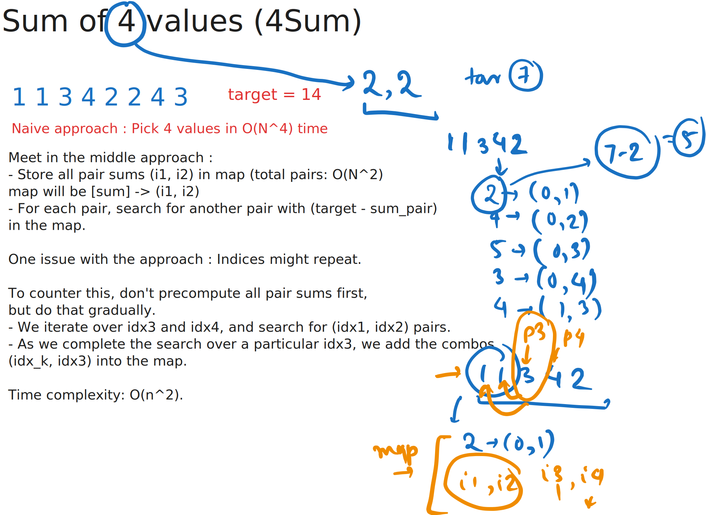

# Day 12

  
    Press Space for next page 

  

---
layout: default
---

## Table of contents

<Toc columns=3></Toc>

---

## Agenda

- Meet in the middle
- Bitmasking

---

## [Sum of 4 values](https://cses.fi/problemset/task/1642/)

[src code](../../code/src/cses/Sum4.java)

---