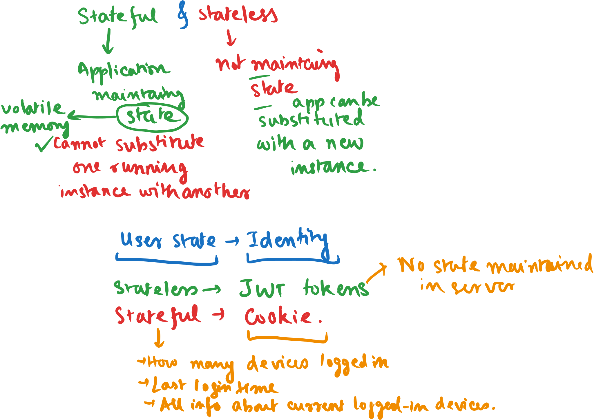
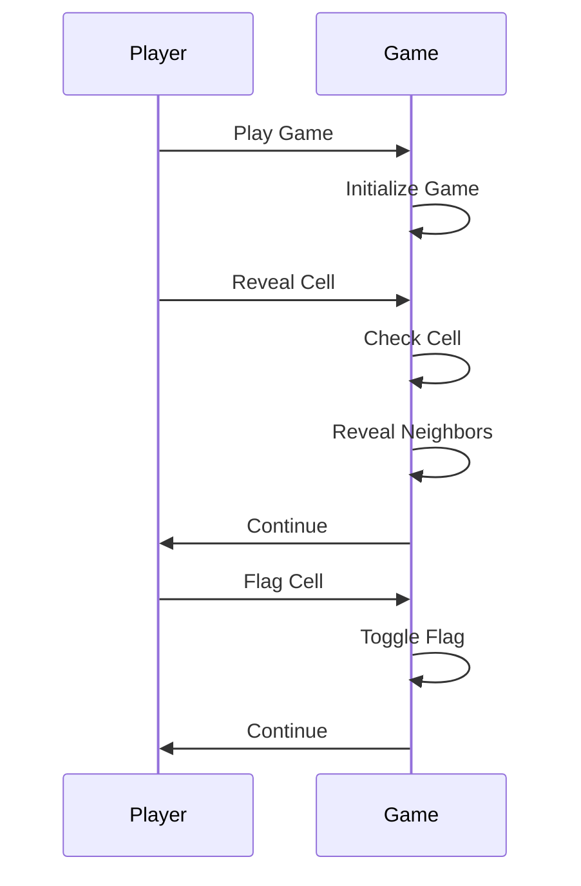
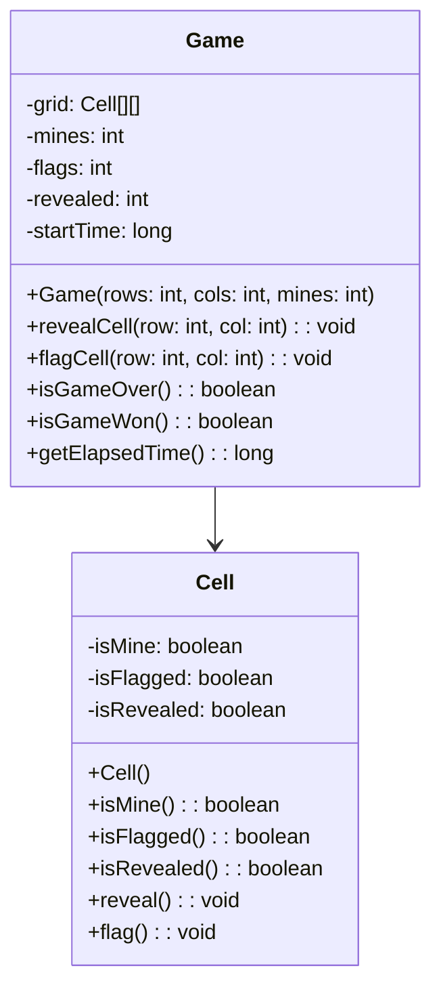
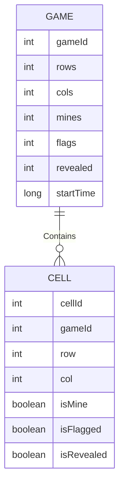

# Day 13


<div class="pt-13">
  <span @click="$slidev.nav.next" class="px-2 py-1 rounded cursor-pointer" flex="~ justify-center items-center gap-2" hover="bg-white bg-opacity-10">
    Press Space for next page <div class="i-carbon:arrow-right inline-block"/>
  </span>
</div>

---
layout: default
---

## Table of contents

<Toc columns=3></Toc>

---

## Agenda

Design a Minesweeper game

Read: https://grantslatton.com/how-to-software

Mermaid: https://mermaid.js.org/syntax/entityRelationshipDiagram.html

Learn Java Concepts and give quizzes: https://hyperskill.org/knowledge-map/73?track=17

---

## Stateful vs Stateless

[LLM conversation](../llm-outputs/Statefulness.md)



---

## SRS (Software Requirements Specification)

- **Title:** Minesweeper Game
- **Purpose:** To provide an interactive game for users to play Minesweeper.
- **Scope:** The game will include a grid of cells that the user can interact with to reveal mines.
- **Features:**
  - Grid of cells with hidden mines.
  - Reveal cells to avoid mines.
  - Flag cells to mark potential mines.
  - Timer to track game duration.
- **User Stories:**
  - As a player, I want to reveal cells to avoid mines.
  - As a player, I want to flag cells to mark potential mines.
  - As a player, I want to track my game duration.
- **Acceptance Criteria:**
  - The game should display a grid of cells.
  - The game should reveal cells when clicked.
  - The game should flag cells when right-clicked.
  - The game should track the time taken to complete.

---

## Mental Models

After the SRS is concretized, we can build some mental models and start the software design process.
These are some useful diagrams that can help us to visualize the software design:
- Sequence Diagram for interaction flow.
- Class Diagram for object-oriented design.
- Entity-Relationship Diagram for data storage.

Use Mermaid syntax, so that :
- Initial version and incremental changes can be easily done with the help of LLMs.
- The diagrams can be rendered in markdown files - github has direct support for mermaid.
- The designs can be version controlled and tracked.

After the mental models are ready, we can start the actual implementation of the game.
- Firstly, we can create the abstract classes for each of the classes recognized in the class diagram.
- Then, we can implement the actual classes and methods. You can do it top-down or bottom-up according to the complexity of the program.
  + Top-down: Start with the main class and then implement the helper classes.
  + Bottom-up: Start with the helper classes and then implement the main class.
- If your application is not too complex, prefer the bottom-up approach. Else, go for the top-down approach. These are just guidelines, you can choose the approach that suits you best.

---

## Bottom-up Approach

**Do it when the application is not too complex. For example, some application you are building for your academic project or a starter project for a screening test.**

This is called the Directed Acyclic Graph (DAG) approach ([as mentioned here](https://grantslatton.com/how-to-software#working-top-to-bottom))

Pros:
- You can do test-driven development (TDD) without using any stub code for the dependent classes.
- You can easily test the helper classes before integrating them into the main class.

Cons:
You're locking yourself into a design before you have written the software! When you're implementing one layer, you're guessing at what API the layer up is going to need, and implementing that.

---

## Top-down Approach

**Do it when the application is complex. For example, a large-scale application like creating a text editor, a word processor, a complex game, etc.**

> A trap some engineers fall into is to view software development as a directed acyclic graph (DAG) of components that depend on each other, and the natural place to start developing software is the components with no dependencies.

What?

> You start coding at the top of the stack, letting each layer define the API of the layer below it. Only once that layer's implementation is beautiful — because the stubbed out API of the layer down is just what it needs — do you implement the layer down.

Pros:
- You always have semi-working software. You always have a UI to show the boss or an API the other team can start testing against. It may not be functionally complete yet, but partial is better than nothing!

---

## Sequence Diagram



---

## Class Diagram



---

## ER Diagram



---

## Abstract Classes (Java)

```java
abstract class Game {
  protected Cell[][] grid;
  protected int mines;
  protected int flags;
  protected int revealed;
  protected long startTime;

  public Game(int rows, int cols, int mines) {
    // Initialize grid
  }

  public abstract void revealCell(int row, int col);
  public abstract void flagCell(int row, int col);
  public abstract boolean isGameOver();
  public abstract boolean isGameWon();
  public abstract long getElapsedTime();
}
```

```java
abstract class Cell {
  protected boolean isMine;
  protected boolean isFlagged;
  protected boolean isRevealed;

  public abstract boolean isMine();
  public abstract boolean isFlagged();
  public abstract boolean isRevealed();
  public abstract void reveal();
  public abstract void flag();
}
```

---

## Now do the actual implementation of the game

---

## Stateful vs Stateless

[LLM conversation](../llm-outputs/Statefulness.md)


---

## HTTP requests using .http file

- Save the sample requests with payloads in a file with `.http` extension.
- You can save the body of the request in the same file or in external files.
- In VSCode, you can use REST Client extension to send HTTP requests.
- In Jetbrains IDEs, you can use the built-in HTTP client to send requests.

[Sample file](../../code/src/http/requests.http)

---

## Other types besides REST

| Name       | Category | Description |
|------------|----------|-------------|
| **REST (Representational State Transfer)** | **Architectural Style** | Uses HTTP and stateless communication with resources represented as URLs. |
| **GraphQL** | **Query Language for APIs** | Allows clients to specify exactly what data they need, reducing over-fetching. |
| **gRPC (gRPC Remote Procedure Call)** | **RPC (Remote Procedure Call) Framework** | Uses HTTP/2 and Protobuf for high-performance, low-latency communication. |
| **SOAP (Simple Object Access Protocol)** | **Protocol** | Uses XML-based messaging over HTTP/SMTP for web services. |
| **WebSockets** | **Full-Duplex Communication Protocol** | Enables real-time, bidirectional communication between client and server. |
| **Webhooks** | **Event-Driven Communication** | Sends real-time notifications from one system to another via HTTP POST. |

[reference](../llm-outputs/RESTetAll.md)

---

## Pocketbase

[Pocketbase](https://pocketbase.io/) is written in go, and it uses SQLite for backend. It's extremely easy to set up.

You can use Pocketbase for setting up your backend quickly. It's no-code solution if you want to:
- Just expose a database as an API.
- Want authentication and authorization built-in, with OAuth, email, OTP, etc.
- If you want to run backend efficiently, using very less memory and CPU.
- If you want to have your own hosted backend, don't want to rely on third-party services for your backend.
- If you want to migrate data frm one server to another easily.

---

