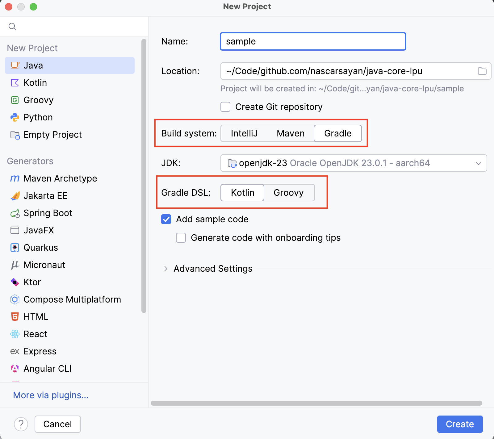
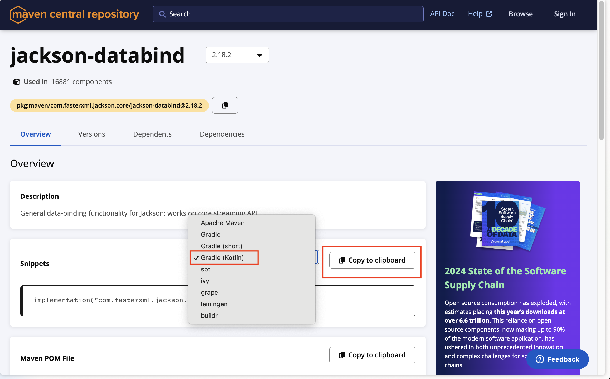
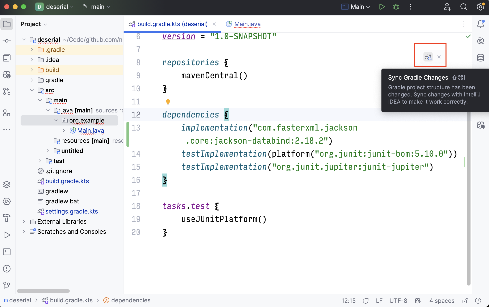

# Day 17


<div class="pt-13">
  <span @click="$slidev.nav.next" class="px-2 py-1 rounded cursor-pointer" flex="~ justify-center items-center gap-2" hover="bg-white bg-opacity-10">
    Press Space for next page <div class="i-carbon:arrow-right inline-block"/>
  </span>
</div>

---
layout: default
---

## Table of contents

<Toc columns=3></Toc>

---

## Agenda

- Data de/serialization in Java
  + JSON
  + XML
  + CSV

---

## Setting up a Java project using Gradle

- In IntelliJ IDEA, create a new project.
- Select Maven / Gradle / Groovy (whichever you prefer).
  + For this example, we will use Gradle with Kotlin DSL.
  
- Select the JDK version. If JDK not installed, Jetbrains will provide the option to download it.
- Select the project name and location.
- Wait for the project to get loaded (might take some time).

---

## Search for 3rd party libraries

- Some functionalities are not provided by stdlib (for example, serialization and deserialization of JSON, XML, CSV).
- For such functionalities, we can use 3rd party libraries.
- To search for 3rd party libraries, we can use:
  + Maven Central Repository: https://search.maven.org/
  + Gradle Plugin Portal: https://plugins.gradle.org/
- There can be multiple 3rd party libraries for the same functionality. Which one to choose?
  + Check the number of downloads.
  + Check the number of stars on GitHub.
  + Check the last commit date.
  + Check the number of issues and pull requests.
  + Check the documentation.
  + Check the community support.

---

## JSON

- JSON (JavaScript Object Notation) is a lightweight data-interchange format.
- JSON to object serialization and deserialization functionality is provided by the Jackson library.

---

## Adding JSON de/se-rializer dependency to your project

- Search for `jackson-databind` in Maven Central Repository (a registry containing links to Java 3rd party libraries). Open the link corresponding to `com.fasterxml.jackson.core:jackson-databind`. Select the appropriate build tool, as per your project. Copy the code snippet to add the dependency to your project.
  
- Add the Jackson databind library to the `build.gradle.kts` file.
  ```kotlin
  dependencies {
    implementation("com.fasterxml.jackson.core:jackson-databind:2.18.2")
  }
  ```
- Sync the Gradle project (to recompute and download the required dependencies). The same thing needs to be done in Maven project too.
  

---

## Serialization from Object to JSON

You want to convert your JSON data to class object which can be processed by Java.
- Create a class with the required fields.
- **Add getter and setter methods** for each of the fields that you want to serialize.
    ```java
    class Car {
        String color;
        String make;

        Car(String color, String make) {
            this.color = color;
            this.make = make;
        }

        public String getColor() {
            return color;
        }

        public String getMake() {
            return make;
        }

        public void setColor(String color) {
            this.color = color;
        }

        public void setMake(String make) {
            this.make = make;
        }
    }
    ```
- Use the `ObjectMapper` class from the Jackson library to serialize the object to JSON.
    ```java
    import com.fasterxml.jackson.core.JsonProcessingException;
    import com.fasterxml.jackson.databind.ObjectMapper;

    public class Main {
        public static void main(String[] args) throws JsonProcessingException {
            var om = new ObjectMapper();
            Car car = new Car("Red", "Tesla");
            try {
                var carJson = om.writeValueAsString(car);
                System.out.println(carJson);
            } catch (Exception e) {
                throw e;
            }
        }
    }
    ```

