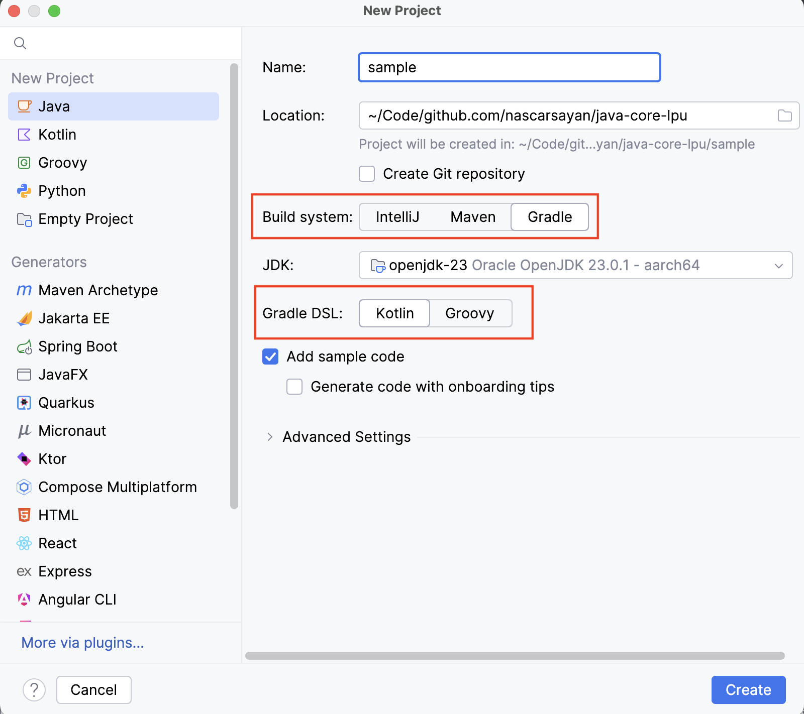
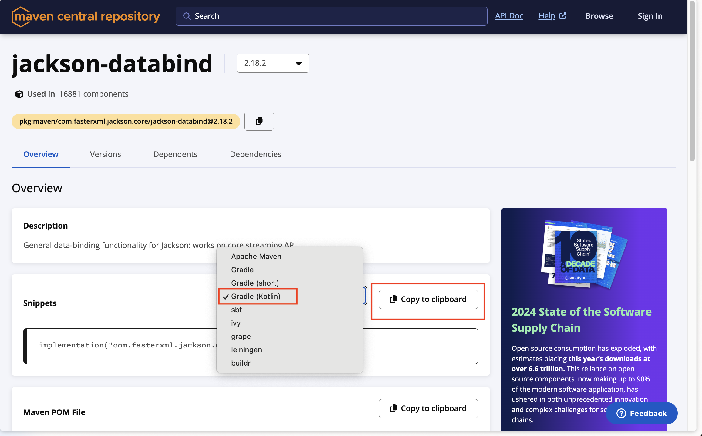
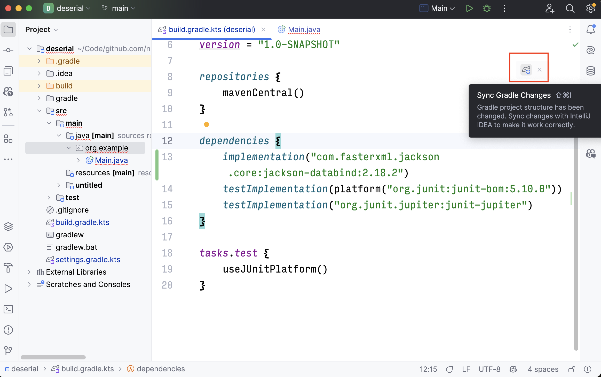

# Day 17


<div class="pt-13">
  <span @click="$slidev.nav.next" class="px-2 py-1 rounded cursor-pointer" flex="~ justify-center items-center gap-2" hover="bg-white bg-opacity-10">
    Press Space for next page <div class="i-carbon:arrow-right inline-block"/>
  </span>
</div>

---
layout: default
---

## Table of contents

<Toc columns=3></Toc>

---

## Agenda

- Data de/serialization in Java
  + JSON
  + XML
  + CSV

---

## Setting up a Java project using Gradle

- In IntelliJ IDEA, create a new project.
- Select Maven / Gradle / Groovy (whichever you prefer).
  + For this example, we will use Gradle with Kotlin DSL.
  
- Select the JDK version. If JDK not installed, Jetbrains will provide the option to download it.
- Select the project name and location.
- Wait for the project to get loaded (might take some time).

---

## Search for 3rd party libraries

- Some functionalities are not provided by stdlib (for example, serialization and deserialization of JSON, XML, CSV).
- For such functionalities, we can use 3rd party libraries.
- To search for 3rd party libraries, we can use:
  + Maven Central Repository: https://search.maven.org/
  + Gradle Plugin Portal: https://plugins.gradle.org/
- There can be multiple 3rd party libraries for the same functionality. Which one to choose?
  + Check the number of downloads.
  + Check the number of stars on GitHub.
  + Check the last commit date.
  + Check the number of issues and pull requests.
  + Check the documentation.
  + Check the community support.

---

## JSON

- JSON (JavaScript Object Notation) is a lightweight data-interchange format.
- JSON to object serialization and deserialization functionality is provided by the Jackson library.

---

## Adding JSON de/se-rializer dependency to your project

- Search for `jackson-databind` in Maven Central Repository (a registry containing links to Java 3rd party libraries). Open the link corresponding to `com.fasterxml.jackson.core:jackson-databind`. Select the appropriate build tool, as per your project. Copy the code snippet to add the dependency to your project.
  
- Add the Jackson databind library to the `build.gradle.kts` file.
  ```kotlin
  dependencies {
    implementation("com.fasterxml.jackson.core:jackson-databind:2.18.2")
  }
  ```
- Sync the Gradle project (to recompute and download the required dependencies). The same thing needs to be done in Maven project too.
  

---

## Serialization from Object to JSON

You want to convert your JSON data to class object which can be processed by Java.
- Create a class with the required fields.
- **Add getter** for each of the fields that you want to serialize.
- How it works:
  + The serialization library will search for all the methods that start with `get` or `is` (for bolean attributes).
  + Each of these methods will be called, and the return value will be set as the value of the corresponding field in the JSON.
  + If you don't want to serialize a field, don't add a getter for that field.
  + You can add cutom getXyz methods (does not correspond to actual xyz attribute in the object), and the serialized JSON will contain a field with the name `xyz`, and the data will be the return value of the method.

    ```java
    class Car {
        String color;
        String make;

        Car(String color, String make) {
            this.color = color;
            this.make = make;
        }

        public String getColor() {
            return color;
        }

        public String getMake() {
            return make;
        }
    }
    ```
- Use the `ObjectMapper` class from the Jackson library to serialize the object to JSON.
    ```java
    import com.fasterxml.jackson.core.JsonProcessingException;
    import com.fasterxml.jackson.databind.ObjectMapper;

    public class Main {
        public static void main(String[] args) throws JsonProcessingException {
            var om = new ObjectMapper();
            Car car = new Car("Red", "Tesla");
            try {
                var carJson = om.writeValueAsString(car);
                System.out.println(carJson);
            } catch (Exception e) {
                throw e;
            }
        }
    }
    ```

---

## Deserialization from JSON to Object

- You want to convert JSON data to a class object which can be processed by Java.
- Create a class with the required fields.
- Add the default constructor.
- **Add setter** for each of the fields that you want to deserialize.
- How it works:
  + The deserialization library will first call the default constructor of the class, to create an object. This default constructor should be visible to the call site (You cna make default constructor `public`).
  + The deserialization library will search for all the methods that start with `set`.
  + Each of these methods will be called, and the value of the corresponding field in the JSON will be set as the return value of the method.
  + If you don't want to deserialize a field, don't add a setter for that field.
  + You can add cutom setXyz methods (does not correspond to actual xyz attribute in the object), and the deserialized JSON will contain a field with the name `xyz`, and the data will be the return value of the method.

    ```java
    class Car {
        String color;
        String make;

        public Car() {}

        public void setColor(String color) {
            this.color = color;
        }

        public void setMake(String make) {
            this.make = make;
        }
    }
    ```
- Use the `ObjectMapper` class from the Jackson library to deserialize the JSON to object.
    ```java
    import com.fasterxml.jackson.core.JsonProcessingException;
    import com.fasterxml.jackson.databind.ObjectMapper;

    public class Main {
        public static void main(String[] args) throws JsonProcessingException {
            var om = new ObjectMapper();
            String jsonData = """
    {
        "make":"Tesla",
        "color":"Blue",
        "someFieldNotPresentInClass": "foobar"
    }
    """;
            try {
                var car2 = om.readValue(carJson, Car.class);
                System.out.printf("Car2 : (%s, %s)\n", car2.make, car2.Color);
            } catch (Exception e) {
                throw e;
            }
        }
    }
    ```
- If some field `xyz` is present in the JSON but not in the class, an exception will be thrown. To avoid this, you can do either:
    + Add the `@JsonIgnoreProperties(ignoreUnknown = true)` annotation on the class.
    + Configure object mapper instance to ignore unknown properties.
      ```java
      import com.fasterxml.jackson.databind.DeserializationFeature;
      // ...
      om.configure(DeserializationFeature.FAIL_ON_UNKNOWN_PROPERTIES, false);
      ```

---

## Complete example

[Serialization and Deserialization example](../../deserial/src/main/java/org/example/Main.java)

---

## Lombok

- Lombok is a library that helps to reduce boilerplate code.
- It provides annotations to generate getters, setters, constructors, etc.
- To add Lombok to your project:
  + Search for `Lombok` in Maven Central Repository. Open the link corresponding to `org.projectlombok:lombok`. Select the appropriate build tool, as per your project. Copy the code snippet to add the dependency to your project.
  + Add the Lombok library to the `build.gradle.kts` file.
    ```kotlin
    dependencies {
        compileOnly("org.projectlombok:lombok:1.18.36")
        annotationProcessor("org.projectlombok:lombok:1.18.36")
    }
    ```
  + Sync the Gradle project (to recompute and download the required dependencies).
- To ensure that the parameter names in the functions are not lost during compilation, add the following to the `build.gradle.kts` file. [Reference](../llm-outputs/WhyUseCompilerOptionParams.md)
  ```kotlin
  tasks.withType<JavaCompile> {
      options.compilerArgs.addAll(listOf("-parameters"))
  }
  ```
- Remove the boilerplate code, and add the annotations.

[Refactored Code](../../deserial/src/main/java/org/example/lombok/LombokUse.java)

---

## XML

- XML (Extensible Markup Language) is a widely used format for structured data representation.
- XML serialization and deserialization in Java can be handled using the `JAXB` library.

---

## Adding XML de/se-rializer dependency to your project

- Search for `javax.xml.bind:jaxb-api` in Maven Central Repository.
- Add the JAXB library to the `build.gradle.kts` file.
  ```kotlin
  dependencies {
      implementation("javax.xml.bind:jaxb-api:2.3.1")
      implementation("org.glassfish.jaxb:jaxb-runtime:2.3.1")
  }
  ```
- Sync the Gradle project to download the required dependencies.

---

## Serialization from Object to XML

- Annotate the class with `@XmlRootElement` and its fields with `@XmlElement`.
- Use the `Marshaller` class to convert the object to an XML string.

  ```java
  import javax.xml.bind.annotation.XmlElement;
  import javax.xml.bind.annotation.XmlRootElement;
  
  @XmlRootElement
  class Car {
      @XmlElement
      String color;
      
      @XmlElement
      String make;
      
      public Car() {}
      
      public Car(String color, String make) {
          this.color = color;
          this.make = make;
      }
  }
  ```
  
  ```java
  import javax.xml.bind.JAXBContext;
  import javax.xml.bind.JAXBException;
  import javax.xml.bind.Marshaller;
  
  public class Main {
      public static void main(String[] args) throws JAXBException {
          Car car = new Car("Red", "Tesla");
          JAXBContext context = JAXBContext.newInstance(Car.class);
          Marshaller marshaller = context.createMarshaller();
          marshaller.setProperty(Marshaller.JAXB_FORMATTED_OUTPUT, true);
          marshaller.marshal(car, System.out);
      }
  }
  ```

---

## Deserialization from XML to Object

- Use the `Unmarshaller` class to parse XML into an object.
  
  ```java
  import javax.xml.bind.JAXBContext;
  import javax.xml.bind.JAXBException;
  import javax.xml.bind.Unmarshaller;
  import java.io.StringReader;
  
  public class Main {
      public static void main(String[] args) throws JAXBException {
          String xmlData = """
          <car>
              <color>Blue</color>
              <make>Tesla</make>
          </car>
          """;
          JAXBContext context = JAXBContext.newInstance(Car.class);
          Unmarshaller unmarshaller = context.createUnmarshaller();
          Car car = (Car) unmarshaller.unmarshal(new StringReader(xmlData));
          System.out.printf("Car: (%s, %s)\n", car.color, car.make);
      }
  }
  ```

---

## Complete example

[Example Code](../../deserial/src/main/java/org/example/xml/XmlUse.java)

---

## CSV

- CSV (Comma-Separated Values) is a simple format for tabular data.
- CSV serialization and deserialization in Java can be handled using the `opencsv` library.

---

## Adding CSV de/se-rializer dependency to your project

- Search for `com.opencsv:opencsv` in Maven Central Repository.
- Add the OpenCSV library to the `build.gradle.kts` file.
  ```kotlin
  dependencies {
      implementation("com.opencsv:opencsv:5.7.1")
  }
  ```
- Sync the Gradle project to download the required dependencies.

---

## Serialization from Object to CSV

- Annotate the class with `@CsvBindByName`.
- Use `CsvToBeanBuilder` to convert a list of objects to CSV.
  
  ```java
  import com.opencsv.bean.CsvBindByName;
  
  public class Car {
      @CsvBindByName
      private String color;
      
      @CsvBindByName
      private String make;
      
      public Car() {}
      
      public Car(String color, String make) {
          this.color = color;
          this.make = make;
      }
  }
  ```
  
  ```java
  import com.opencsv.CSVWriter;
  import java.io.FileWriter;
  import java.io.IOException;
  
  public class Main {
      public static void main(String[] args) throws IOException {
          String[] header = {"color", "make"};
          String[] carData = {"Red", "Tesla"};
          
          try (CSVWriter writer = new CSVWriter(new FileWriter("cars.csv"))) {
              writer.writeNext(header);
              writer.writeNext(carData);
          }
      }
  }
  ```

---

## Deserialization from CSV to Object

- Use `CsvToBeanBuilder` to parse CSV into a list of objects.
  
  ```java
  import com.opencsv.bean.CsvToBean;
  import com.opencsv.bean.CsvToBeanBuilder;
  import java.io.FileReader;
  import java.io.Reader;
  import java.util.List;
  
  public class Main {
      public static void main(String[] args) throws Exception {
          Reader reader = new FileReader("cars.csv");
          CsvToBean<Car> csvToBean = new CsvToBeanBuilder<Car>(reader)
                  .withType(Car.class)
                  .withIgnoreLeadingWhiteSpace(true)
                  .build();
          
          List<Car> cars = csvToBean.parse();
          for (Car car : cars) {
              System.out.printf("Car: (%s, %s)\n", car.getColor(), car.getMake());
          }
      }
  }
  ```

---

## Complete example

[Example Code](../../deserial/src/main/java/org/example/csv/CsvUse.java)

---

## What is Java Bean

### **What is a Bean in Java?**  

A **Java Bean** is a standard Java class that follows specific conventions, primarily used for encapsulating data. Beans are widely used in frameworks and libraries like Spring, Java EE, and tools like OpenCSV for object mapping.

---

### **Key Characteristics of a Java Bean**
1. **Private Fields**  
   - The class fields (variables) should be **private** to enforce encapsulation.
   
2. **Public Getters and Setters**  
   - The class should provide **public getter and setter methods** to allow controlled access to private fields.

3. **A No-Argument Constructor**  
   - A **public no-arg constructor** is required so that frameworks and tools can create instances automatically.

4. **Serializable (Optional but Recommended)**  
   - Java Beans often implement `Serializable` to support easy persistence and data transfer.

---

### **Example of a Java Bean**
```java
import java.io.Serializable;

public class Car implements Serializable {
    private String color;
    private String make;

    // No-argument constructor
    public Car() {}

    // Constructor with parameters
    public Car(String color, String make) {
        this.color = color;
        this.make = make;
    }

    // Getter and Setter for color
    public String getColor() {
        return color;
    }
    public void setColor(String color) {
        this.color = color;
    }

    // Getter and Setter for make
    public String getMake() {
        return make;
    }
    public void setMake(String make) {
        this.make = make;
    }
}
```

---

### **Why Use Beans?**
- **Encapsulation**: Keeps data secure and accessible only through defined methods.
- **Framework Compatibility**: Many frameworks (e.g., Spring, Hibernate, OpenCSV) rely on bean conventions for automatic object creation.
- **Serialization Support**: Can be easily converted into different formats like JSON, XML, or stored in a database.
