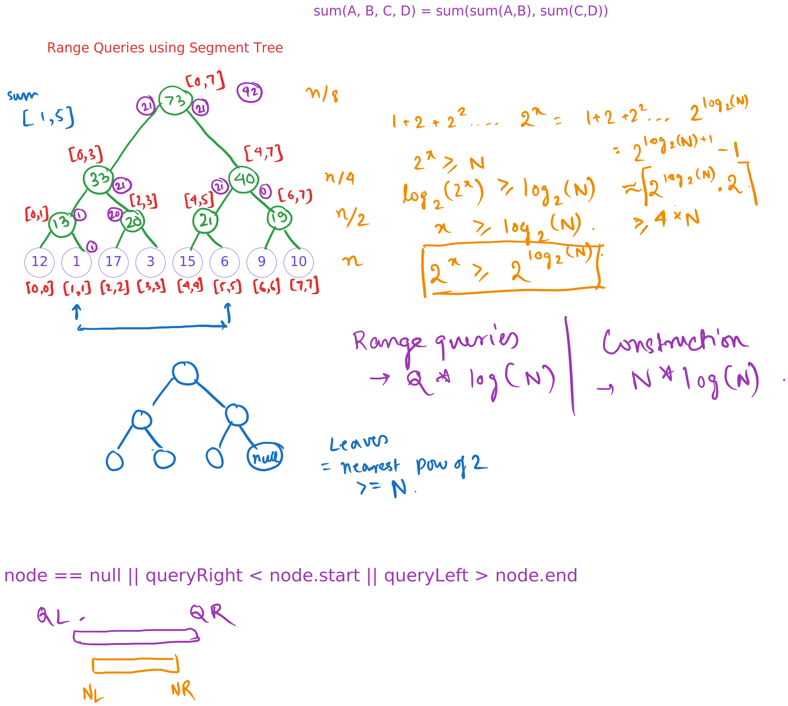
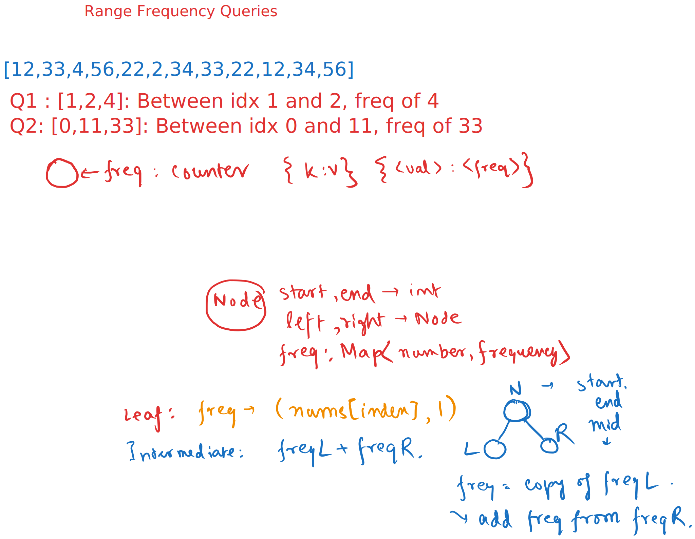
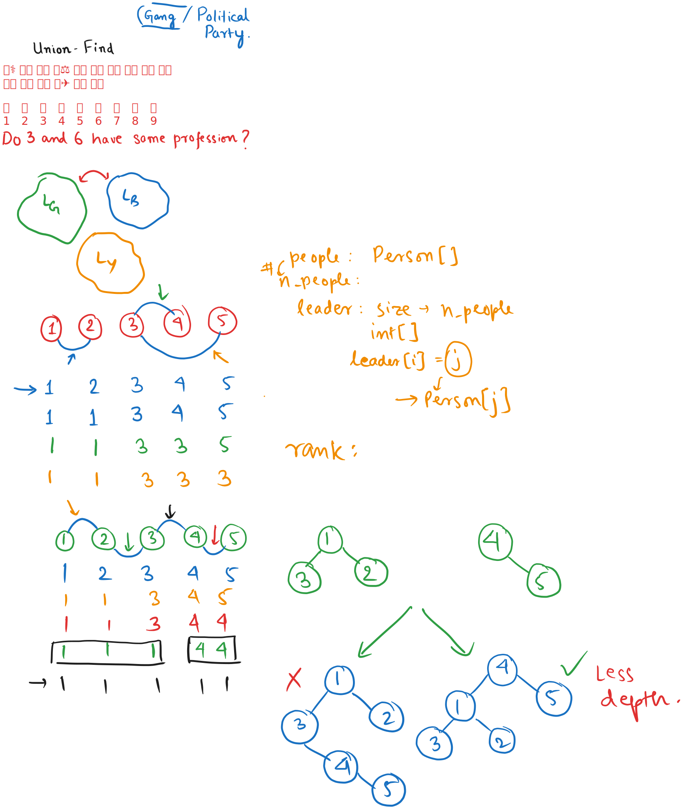

# Day 18


<div class="pt-13">
  <span @click="$slidev.nav.next" class="px-2 py-1 rounded cursor-pointer" flex="~ justify-center items-center gap-2" hover="bg-white bg-opacity-10">
    Press Space for next page <div class="i-carbon:arrow-right inline-block"></div>
  </span>
</div>

---
layout: default
---

## Table of contents

<Toc columns=3></Toc>

---

## Agenda

- Segment Tree
- Problems on Segment Tree
  + https://leetcode.com/problems/range-sum-query-mutable/description/
  + https://leetcode.com/problems/range-frequency-queries/description/
- Union-Find or Disjoint Set Union

---

## Use of Segment Tree

- Range (aggregate) Queries (Sum, Min, Max, etc.) over a subarray.
- The aggregate function should be associative and commutative.
- Range Updates (add a delta value / multiply by a value) over a subarray.

---

## Example

Given an array `arr`, what is the sum of elements in the range `[l, r]`?

12, 1, 17, 3, 15, 6, 9, 10

---

## Explanation



---

## Code

[Source Code](../../code/src/collections/SegmentTree.java)

---

## Range Frequency Queries (using Prefix-Sum like approach)

- We could solve this problem using prefix-sum like approach.
  + However, the size complexity of the problem becomes `O(N*2)` if all elements are distinct - and can cause memory limit exceeded.

Code will look like this:

```java
// Will lead to memory limit exceeded.
class RangeFreqQuery {
    HashMap<Integer, Integer>[] freqTillIdx;
    public RangeFreqQuery(int[] arr) {
        freqTillIdx = new HashMap[arr.length+1];
        for (int i = 0; i <= arr.length; i++) {
            freqTillIdx[i] = new HashMap<>();
        }
        for (int i = 1; i <= arr.length; i++) {
            freqTillIdx[i].putAll(freqTillIdx[i-1]);
            freqTillIdx[i].merge(arr[i-1], 1, Integer::sum);
        }
    }

    public int query(int left, int right, int value) {
        var l = freqTillIdx[left];
        var r = freqTillIdx[right+1];
        return r.getOrDefault(value, 0) - l.getOrDefault(value, 0);
    }
}
```

---

## Range Frequency Queries (using Segment Tree)

- To reduce the size complexity, we can use Segment Tree. The memory complexity will be `O(N*log(N))`. [Reference](../llm-outputs/MemoryComplexityRangeFreq.md)



[Source Code](../../code/src/leetcode/RangeFrequencyQueries.java)

---

## Union Find



---

### Union-Find (Disjoint Set Union - DSU) in Java

The **Union-Find** data structure, also known as the **Disjoint Set Union (DSU)**, is a powerful tool used to manage collections of disjoint sets efficiently. It supports two primary operations:

1. **Find**: Determine which set a particular element belongs to.
2. **Union**: Merge two sets into one.

#### Key Features:
- **Path Compression**: Optimizes the `find` operation by flattening the structure of the tree, making future queries faster.
- **Union by Rank/Size**: Ensures that smaller trees are attached to larger ones, keeping the tree balanced and improving efficiency.

#### Implementation in Java:
Here’s a basic implementation of the Union-Find data structure in Java:

```java
class UnionFind {
    private int[] parent;
    private int[] rank;

    // Constructor to initialize the Union-Find structure
    public UnionFind(int size) {
        parent = new int[size];
        rank = new int[size];
        for (int i = 0; i < size; i++) {
            parent[i] = i; // Each element is its own parent initially
            rank[i] = 1;   // Initially, each set has a rank of 1
        }
    }

    // Find the root of the set containing element x with path compression
    public int find(int x) {
        if (parent[x] != x) {
            parent[x] = find(parent[x]); // Path compression
        }
        return parent[x];
    }

    // Union two sets containing elements x and y using union by rank
    public boolean union(int x, int y) {
        int rootX = find(x);
        int rootY = find(y);

        if (rootX == rootY) {
            return false; // Already in the same set
        }

        // Union by rank
        if (rank[rootX] > rank[rootY]) {
            parent[rootY] = rootX;
        } else if (rank[rootX] < rank[rootY]) {
            parent[rootX] = rootY;
        } else {
            parent[rootY] = rootX;
            rank[rootX]++;
        }

        return true;
    }

    // Check if two elements are connected (i.e., in the same set)
    public boolean isConnected(int x, int y) {
        return find(x) == find(y);
    }
}
```

---

## [Number of Provinces](https://leetcode.com/problems/number-of-provinces/)

[source code](../../code/src/leetcode/NumberOfProvinces.java)

---

## Range Sum Query 2D - Immutable

https://www.lintcode.com/problem/665/

[source code](../../code/src/leetcode/RangeSumQuery2DImmutable.java)

---

## Accounts Merge

[source code](../../code/src/leetcode/AccountsMerge.java)

