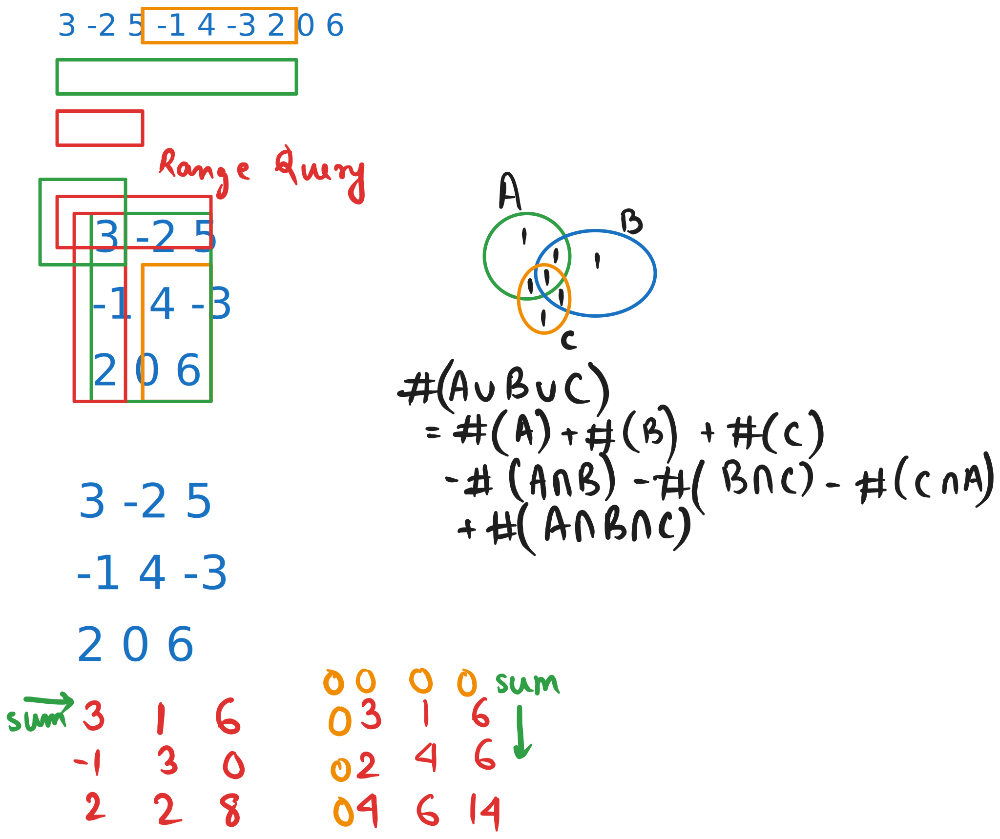

# Day 19

  
    Press Space for next page 

  

---
layout: default
---

## Table of contents

<Toc columns=3></Toc>

---

## Agenda

- Working with Ranges / Intervals
- Explain missed concepts and practice from https://www.hellointerview.com/

---

# Range Sum Query 2D - Immutable

---

# Problems

- https://www.codechef.com/practice/course/2-star-difficulty-problems/DIFF1500/problems/AVGPERM
- https://cses.fi/problemset/task/1090

---

