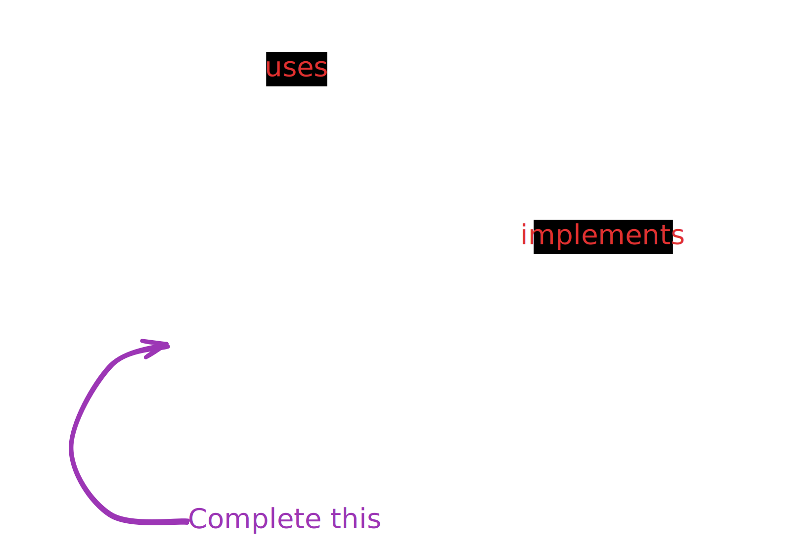

# Day 20

  
    Press Space for next page 

  

---
layout: default
---

## Table of contents

<Toc columns=3></Toc>

---

## Agenda

1. Project assigment.

---

## Project Overview

[Sample Project Readme](../../projects/TaskManager/)

---

## Learning JS (and Web basics)

https://developer.mozilla.org/en-US/docs/Learn_web_development/Core/Scripting/A_first_splash

https://web.dev/learn/javascript

---

