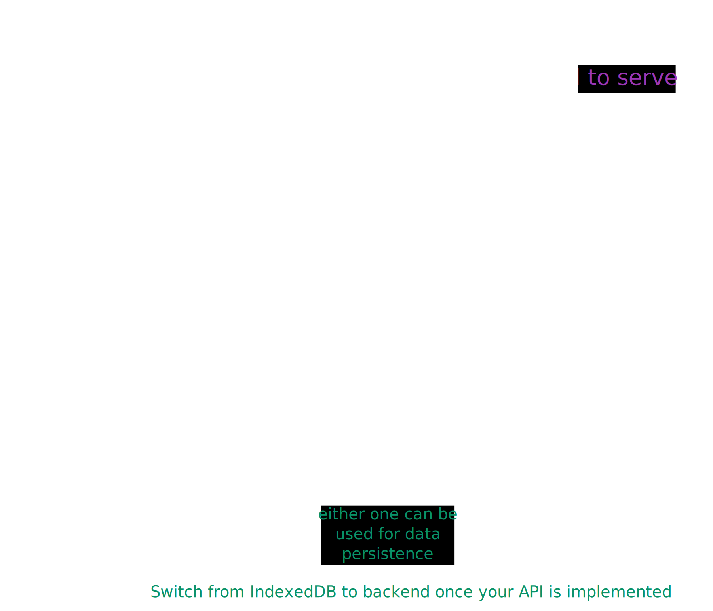

# Day 20


<div class="pt-13">
  <span @click="$slidev.nav.next" class="px-2 py-1 rounded cursor-pointer" flex="~ justify-center items-center gap-2" hover="bg-white bg-opacity-10">
    Press Space for next page <div class="i-carbon:arrow-right inline-block"/>
  </span>
</div>

---
layout: default
---

## Table of contents

<Toc columns=3></Toc>

---

## Agenda

1. Project assigment.

---

## Project Overview



[Sample Project Readme](../../projects/TaskManager/)

---

## Learning JS (and Web basics)

https://developer.mozilla.org/en-US/docs/Learn_web_development/Core/Scripting/A_first_splash

https://web.dev/learn/javascript

---

## Understand the codebase

To run the Java code, go to the [root of the Java application](../../projects/TaskManager/) and open IntelliJ Idea at that location. Once project loads up, run the `TaskManagerApplication` class.

If you just want to run the frontend code using any server, go to [the static directory](../../projects/TaskManager/src/main/resources/static/) and run the server.

```bash
python -m http.server
```

OR

```bash
npx serve .
```

---
