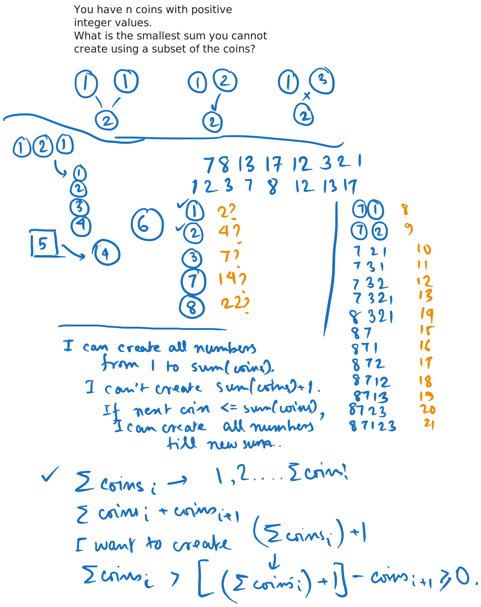
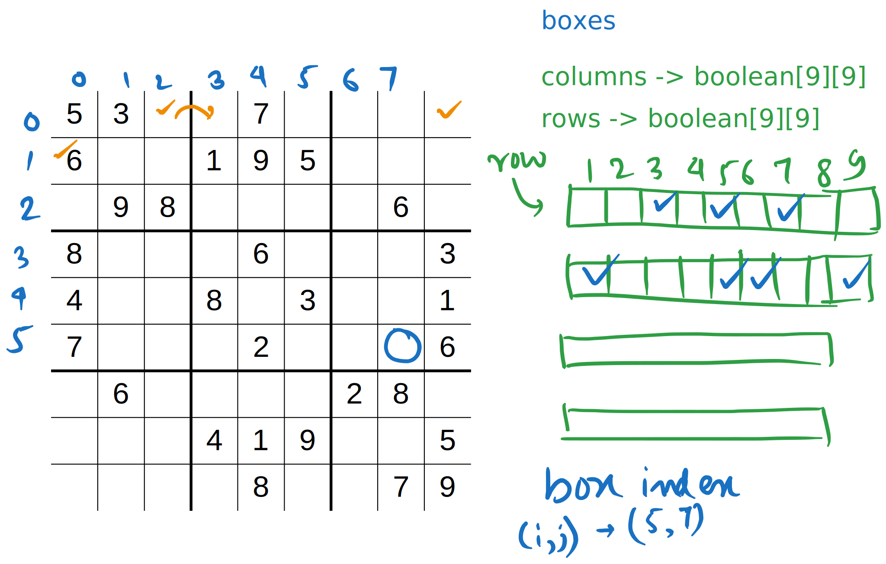
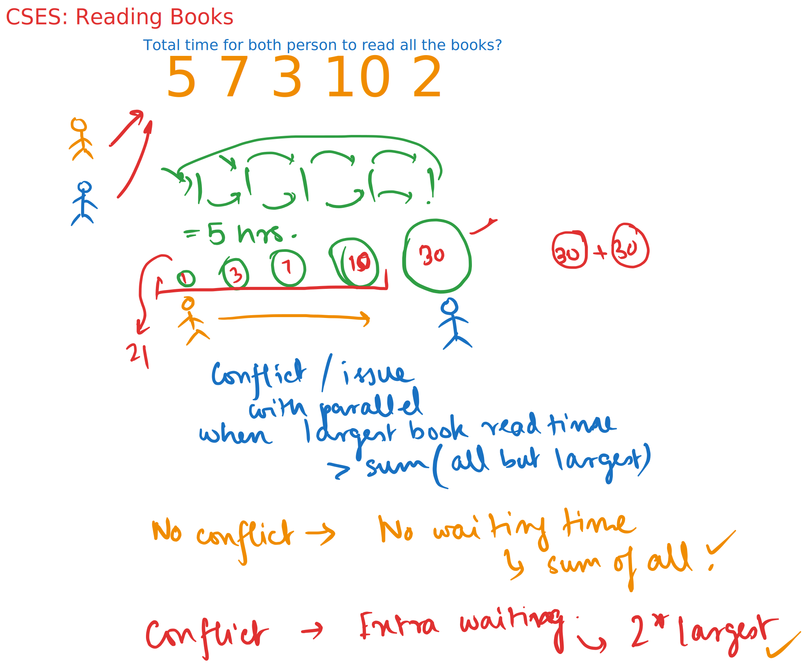

# Day 21

  
    Press Space for next page 

  

---
layout: default
---

## Table of contents

<Toc columns=3></Toc>

---

## Agenda

- Mixed practice

---

## [Missing Coin Sum](https://cses.fi/problemset/task/2183)

[source code](../../code/src/cses/MissingCoinSum.java)

---

## [Sudoku Solver](https://leetcode.com/problems/sudoku-solver)

[source code](../../code/src/leetcode/SudokuSolver.java)

---

## [Reading Books](https://cses.fi/problemset/task/1631/)

[source code](../../code/src/cses/ReadingBooks.java)

---

## Projects

### 1. **Task Assignment System**  
   - **Entities**: `Task`, `Worker`  
   - **Relationships**: A `Worker` is assigned multiple `Tasks`  
   - **Functionality**: Assign, track, and complete tasks for different workers.  

### 2. **Library Management System**  
   - **Entities**: `Book`, `Author`  
   - **Relationships**: An `Author` writes multiple `Books`  
   - **Functionality**: Search, categorize, and manage books with author details.  

### 3. **Event Scheduling System**  
   - **Entities**: `Event`, `Venue`  
   - **Relationships**: A `Venue` hosts multiple `Events`  
   - **Functionality**: Schedule, reschedule, and track events at different venues.  

### 4. **Product Inventory System**  
   - **Entities**: `Product`, `Category`  
   - **Relationships**: A `Category` contains multiple `Products`  
   - **Functionality**: Manage stock levels, add/remove products, and filter by category.  

### 5. **Student Course Registration**  
   - **Entities**: `Student`, `Course`  
   - **Relationships**: A `Student` enrolls in multiple `Courses`  
   - **Functionality**: Students register for courses, drop them, and view their schedule.  

### 6. **Movie Review System**  
   - **Entities**: `Movie`, `Review`  
   - **Relationships**: A `Movie` has multiple `Reviews`  
   - **Functionality**: Add reviews, rate movies, and browse ratings.  

### 7. **Appointment Booking System**  
   - **Entities**: `Appointment`, `TimeSlot`  
   - **Relationships**: An `Appointment` is scheduled within a `TimeSlot`  
   - **Functionality**: Book, reschedule, and cancel appointments.  

### 8. **Voting and Polling System**  
   - **Entities**: `Poll`, `Option`, `Vote`  
   - **Relationships**: A `Poll` has multiple `Options`, and each `Option` can receive `Votes`  
   - **Functionality**: Create polls, vote, and see results.  

### 9. **Expense Tracking System**  
   - **Entities**: `Expense`, `Category`  
   - **Relationships**: An `Expense` belongs to a `Category`  
   - **Functionality**: Log expenses, categorize them, and view spending reports.  

### 10. **E-commerce Cart System**  
   - **Entities**: `Product`, `CartItem`  
   - **Relationships**: A `CartItem` is linked to a `Product`  
   - **Functionality**: Add/remove items from the cart and manage quantities.  

---

