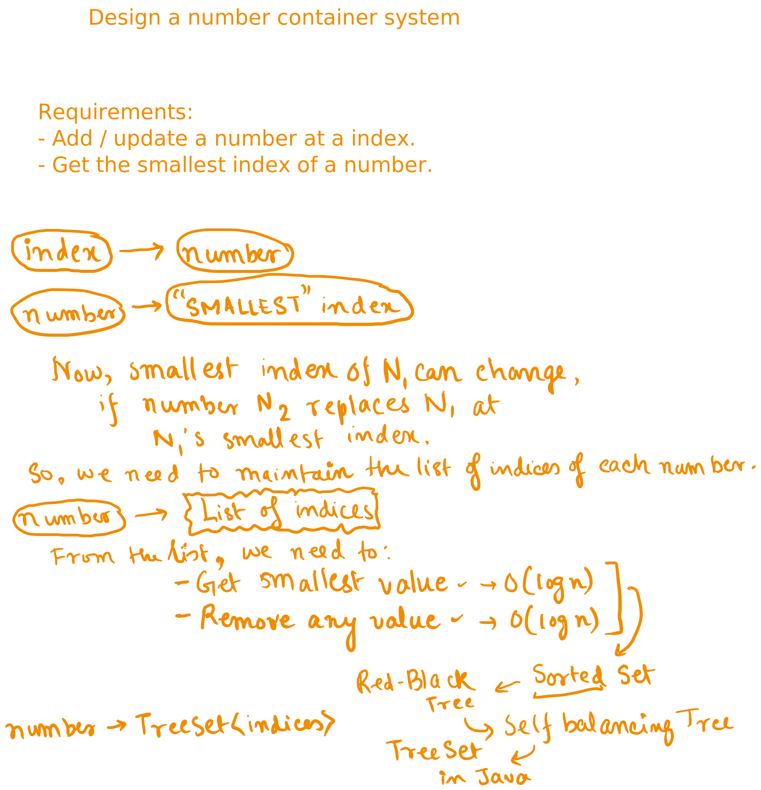

# Day 22


<div class="pt-13">
  <span @click="$slidev.nav.next" class="px-2 py-1 rounded cursor-pointer" flex="~ justify-center items-center gap-2" hover="bg-white bg-opacity-10">
    Press Space for next page <div class="i-carbon:arrow-right inline-block"></div>
  </span>
</div>

---
layout: default
---

## Table of contents

<Toc columns=3></Toc>

---

## Agenda

- Mixed practice

---

## [Design a Number Container System](https://leetcode.com/problems/design-a-number-container-system/description/?envType=daily-question&envId=2025-02-08)



[source code](../../code/src/leetcode/NumberContainerSystem.java)

---

## Concurrency

Tip: State should not be maintained within the locks themselves, but we should use some variables to maintain the state.

[codes](../../code/src/leetcode/concurrency/)

---

## Backtracking

Solve puzzles from River Crossing IQ

https://www.youtube.com/watch?v=r3DfWNxXhZc

---

## River Crossing: [WolfSheepCabbage](https://www.youtube.com/watch?v=r3DfWNxXhZc)


[source code](../../code/src/river_crossing/P01WolfSheepCabbage.java)

> [!IMPORTANT]
> Similarly try to solve the other puzzles from the [video](https://www.youtube.com/watch?v=r3DfWNxXhZc) - The only backtracking problems that you will need to solve to get good at recursion

Code in python is smaller

```python
class State:
    def __init__(self, man_present=True, items=None):
        self.man_present = man_present
        # Wolf, sheep, cabbage represented as booleans
        # True means item is on the starting bank
        self.items = items if items is not None else [True] * 3

    def copy(self):
        return State(self.man_present, self.items.copy())

    def __eq__(self, other):
        if not isinstance(other, State):
            return False
        return (self.man_present == other.man_present and 
                self.items == other.items)

    def __hash__(self):
        # Convert list to tuple for hashing
        return hash((self.man_present, tuple(self.items)))

    def next_states(self):
        """Generate all possible next states."""
        states = []
        
        # Man can move alone or with one item
        for i in range(-1, 3):  # -1 represents man moving alone
            next_state = self.copy()
            next_state.man_present = not next_state.man_present
            
            if i >= 0:  # If taking an item
                next_state.items[i] = not next_state.items[i]
                
            states.append(next_state)
            
        return states

    def is_valid(self):
        """Check if current state is valid (no items eating each other)."""
        # Wolf and sheep can't be alone
        if self.items[0] == self.items[1] and self.items[0] != self.man_present:
            return False
        # Sheep and cabbage can't be alone
        if self.items[1] == self.items[2] and self.items[1] != self.man_present:
            return False
        return True

    def is_final(self):
        """Check if all items have been moved to the other bank."""
        return not any(self.items)

    def __str__(self):
        items = ['Wolf', 'Sheep', 'Cabbage']
        left_bank = ['Man'] if self.man_present else []
        right_bank = ['Man'] if not self.man_present else []
        
        for item, present in zip(items, self.items):
            if present:
                left_bank.append(item)
            else:
                right_bank.append(item)
                
        return f"{' '.join(left_bank)} | {' '.join(right_bank)}"


def solve_puzzle():
    initial_state = State()
    visited = set()
    path = []

    def recurse(state):
        visited.add(state)
        path.append(state)
        if state.is_final():
            return True
        for next_state in state.next_states():
            if next_state in visited or not next_state.is_valid():
                continue
            if recurse(next_state):
                return True
            path.pop()
        return False

    if recurse(initial_state):
        return path
    return None


if __name__ == "__main__":
    solution = solve_puzzle()
    if solution:
        print("\nSolution found:")
        for i, state in enumerate(solution):
            print(f"Step {i}: {state}")
    else:
        print("No solution found!")
```

---
