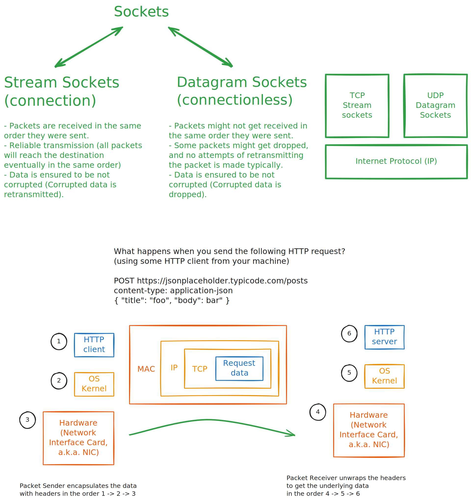

# Day 23


<div class="pt-13">
  <span @click="$slidev.nav.next" class="px-2 py-1 rounded cursor-pointer" flex="~ justify-center items-center gap-2" hover="bg-white bg-opacity-10">
    Press Space for next page <div class="i-carbon:arrow-right inline-block"></div>
  </span>
</div>

---
layout: default
---

## Table of contents

<Toc columns=3></Toc>

---

## Agenda

- Beej Guides intro
- [Network programming](https://beej.us/guide/bgnet/html/)

---

## About Beej Guides

[Beej Guides](https://beej.us/guide/) are a good place to understand lower level concepts (by doing) like:
- [Network programming](https://beej.us/guide/bgnet/html/)
- [Inter-process communication (IPC)](https://beej.us/guide/bgipc/html/)
- [Git](https://beej.us/guide/bggit/html/)

One can follow the guides, and write the C code to have the whole thing under own control instead of just passively watching / reading.

---

## Network Layers

A layered model more consistent with Unix might be:

- Application Layer (telnet, ftp, etc.)
- Host-to-Host Transport Layer (TCP, UDP)
- Internet Layer (IP and routing)
- Network Access Layer (Ethernet, wi-fi, or whatever)



---

## Subnetting

Dividing the pizza (or pie) into slices.

[`sipcalc`](https://github.com/sii/sipcalc) can be used to calculate subnet information.

```bash
sipcalc 10.54.6.12/28
```

Output:

```
-[ipv4 : 10.54.6.12/28] - 0

[CIDR]
Host address            - 10.54.6.12
Host address (decimal)  - 171312652
Host address (hex)      - A36060C
Network address         - 10.54.6.0
Network mask            - 255.255.255.240
Network mask (bits)     - 28
Network mask (hex)      - FFFFFFF0
Broadcast address       - 10.54.6.15
Cisco wildcard          - 0.0.0.15
Addresses in network    - 16
Network range           - 10.54.6.0 - 10.54.6.15
Usable range            - 10.54.6.1 - 10.54.6.14
```

---

## Python primer

- You don't need jupyter notebook for python. You can use use VSCode for the same.
  + Use `#%%` to separate code blocks in python file (`.py`). You can run the code blocks using `Run Cell` option which shows up when you hover over the `#%%` block. You can also use `Ctrl + Enter` to run the code block.
  + You can also open `ipynb` files in VSCode and run the code blocks.

[source code](../../code/src/leetcode/pyForDSA.py)

---

