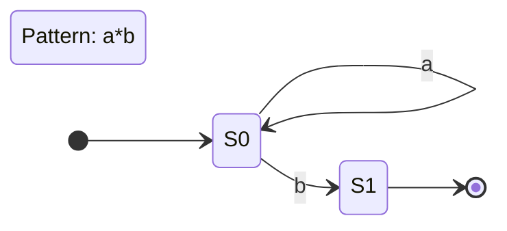
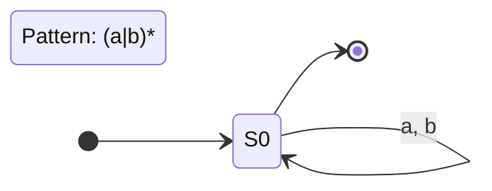
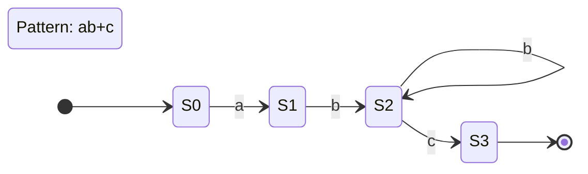
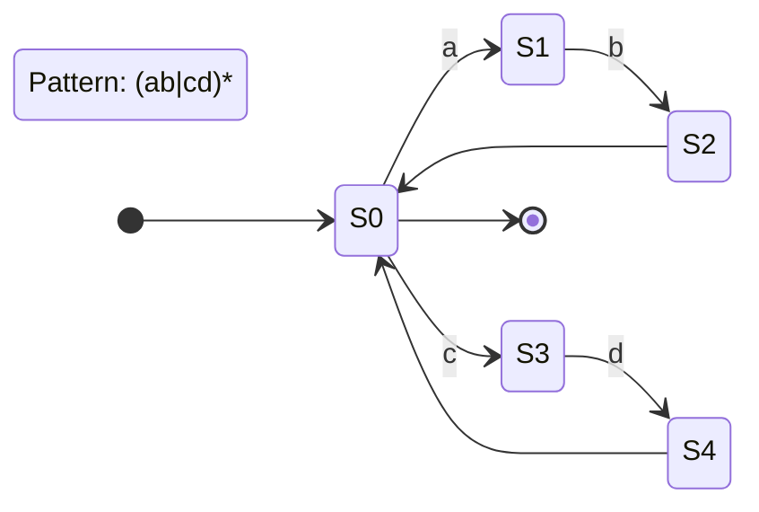
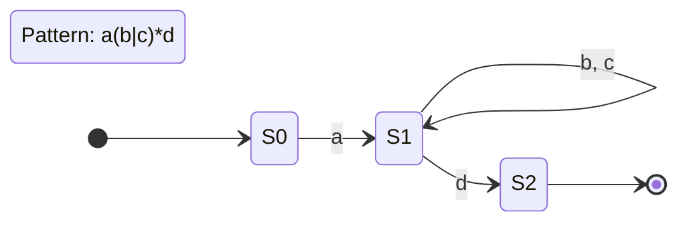

# Day 24

  
    Press Space for next page 

  

---
layout: default
---

## Table of contents

<Toc columns=3></Toc>

---

## Agenda

- Mixed Practice

---

## Z-algorithm

- [Z-algorithm](https://cp-algorithms.com/string/z-function.html)

---

## LeetCode Daily - [Remove all Occurences of a String](https://leetcode.com/problems/remove-all-occurrences-of-a-substring/description/)

We iterate over the string iteratively, until we find a substring match.
If we find a match, we remove the substring and continue the iteration.

To find the match, we perform Z-algorithm on `<pattern>#<text>` and check if any value is equal to `pattern.length`. The matched part should start after the `#`.
If we find a match, we chunk out that part and continue the iteration.

[source code](../../code/src/leetcode/daily/RemoveAllOccurenceOfSubstring.java)

---

## Regular Expressions

### What is a Regular Expression?
- A sequence of characters defining a search pattern.
- Used for pattern matching in text.
- Common in search engines, data validation, and text processing.

### Usage
- Powerful tool for text parsing and manipulation.
- Used in programming languages, command-line tools, and databases.

## Syntax

### Character Classes
- `[a-z]` → Matches any lowercase letter.
- `\d` → Matches any digit (0-9).
- `\w` → Matches any word character (alphanumeric + underscore).

### Quantifiers
- `*` → 0 or more repetitions (e.g., `a*` matches ``, `a`, `aa`, ...)
- `+` → 1 or more repetitions (e.g., `a+` matches `a`, `aa`, ... but not ``)
- `?` → 0 or 1 repetition (e.g., `colou?r` matches `color` and `colour`)
- `{n,m}` → Between `n` and `m` repetitions (e.g., `a{2,4}` matches `aa`, `aaa`, `aaaa`)

### Anchors
- `^` → Matches the start of a string.
- `$` → Matches the end of a string.

### Groups and Alternation
- `()` → Capturing group (e.g., `(ab)+` matches `ab`, `abab`, `ababab`)
- `|` → Alternation (e.g., `cat|dog` matches `cat` or `dog`)

### Lookaheads and Lookbehinds
- **Positive Lookahead**: `foo(?=bar)` matches `foo` only if followed by `bar`.
- **Negative Lookahead**: `foo(?!bar)` matches `foo` only if not followed by `bar`.

### Backreferences
- `(\w)\1` matches repeated characters, e.g., `aa`, `bb`.

### Greedy vs. Non-Greedy Matching
- Greedy: `.*` matches the longest possible string.
- Non-Greedy: `.*?` matches the shortest possible string.

## Performance Considerations in Regular Expressions

### When is Regex Fast?
- Simple patterns that can be efficiently processed.
- Anchored patterns (e.g., `^pattern` for beginning of string).

### When is Regex Slow?
- Patterns with excessive backtracking (e.g., `.*a` in a long text).
- Nested quantifiers (e.g., `(a+)+` can cause exponential slowdowns).

---

## Exercise

- [Regex Crossword](https://regexcrossword.com/)

---

## Regex State Diagrams

Regular Expressions can be visualized using state diagrams. Here are a few examples:

---

## [River Crossing Backtracking - Popeye](https://www.youtube.com/watch?v=r3DfWNxXhZc&t=158s)

Help a family of 5 people move across the river by boat, and the boat is capable of a **maximum of 2 people** carrying capacity. Time for travelling of each person in turn is **1 second, 3 seconds, 6 seconds, 8 seconds, and 12 seconds**. If two people both go on the boat, the boat will travel at **the speed of the slower person**. In **30 Seconds** please bring the whole family across the river.

---

[source code](../../code/src/river_crossing/P04Popeye.java)

